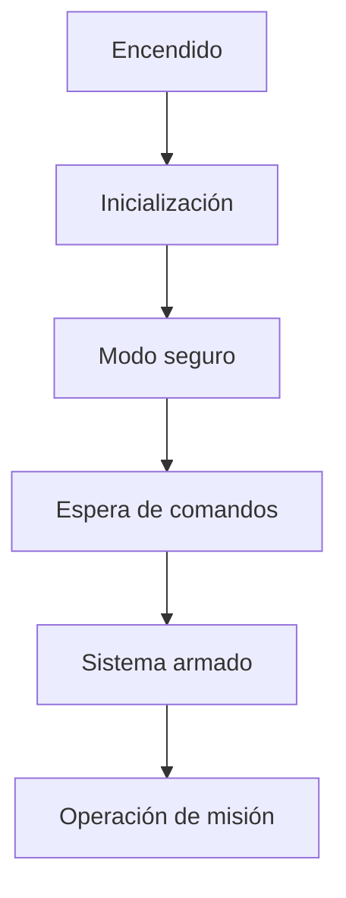

# ¿Cómo contribuir?

TheRocketProject es un proyecto de código y hardware abierto orientado al desarrollo de cohetería experimental. Su objetivo es construir una plataforma técnica, modular y colaborativa donde estudiantes, desarrolladores, investigadores y equipos aeroespaciales puedan aprender, documentar, diseñar, probar y mejorar sistemas relacionados con cohetes experimentales.

Cualquier contribución es bienvenida, desde correcciones pequeñas en la documentación hasta propuestas de firmware, hardware, herramientas de análisis, procedimientos de prueba o contenido técnico relacionado con cohetería.

!!! note "Proyecto en etapa inicial"
    TheRocketProject se encuentra en una etapa temprana de desarrollo. La estructura, documentación, firmware y hardware pueden cambiar conforme el proyecto evolucione. Las contribuciones tempranas son especialmente valiosas para definir buenas prácticas desde el inicio.

## Formas de contribuir

Puedes contribuir al proyecto de distintas maneras:

| Área                   | Ejemplos de contribución                                                                                                           |
| ---------------------- | ---------------------------------------------------------------------------------------------------------------------------------- |
| Documentación          | Corrección de errores, mejora de redacción, diagramas, traducciones, ejemplos y guías de uso.                                      |
| Firmware               | Drivers, módulos de sensores, registro de datos, telemetría, manejo de errores, pruebas y arquitectura del sistema.                |
| Hardware               | Revisión de esquemáticos, pinout, diagramas, integración eléctrica, recomendaciones de diseño y documentación de PCB.              |
| Pruebas                | Procedimientos de banco, checklists, criterios de aceptación, reportes de validación y análisis de resultados.                     |
| Herramientas           | Scripts para análisis de datos, conversión de logs, visualización, simulación o automatización de procesos.                        |
| Cohetería experimental | Contenido técnico sobre recuperación, integración mecánica, estabilidad, bancos de prueba, fabricación simple y análisis de vuelo. |
| Comunidad              | Reporte de errores, propuestas de mejora, revisión de pull requests, discusión técnica y apoyo a nuevos usuarios.                  |

## Principios del proyecto

Antes de contribuir, considera los siguientes principios:

* La documentación debe ser clara, reproducible y fácil de seguir.
* El firmware debe ser modular, legible y seguro.
* El hardware debe documentarse con suficiente detalle para facilitar revisión, fabricación e integración.
* Las pruebas deben incluir condiciones, procedimiento, resultado esperado y criterios de aceptación.
* Las contribuciones deben priorizar la seguridad de personas, instalaciones y terceros.
* Toda mejora debe buscar que el proyecto sea más accesible para la comunidad.

## Seguridad y responsabilidad
La cohetería experimental puede involucrar riesgos importantes. Por esta razón, cualquier contribución relacionada con sistemas de recuperación, activación de eventos, ignición, propulsión, bancos de prueba o integración del vehículo debe tratarse con especial cuidado.

!!! warning "Seguridad"
    No se aceptarán contribuciones que promuevan prácticas inseguras, instrucciones peligrosas, procedimientos sin control, uso irresponsable de materiales energéticos o cualquier contenido que pueda comprometer la seguridad de personas, instalaciones o terceros.

Las contribuciones técnicas deben mantenerse dentro de un enfoque educativo, experimental y responsable. Siempre que aplique, se recomienda incluir:

* Advertencias de seguridad.
* Condiciones de prueba.
* Equipo mínimo recomendado.
* Riesgos identificados.
* Procedimientos de verificación.
* Criterios para detener una prueba.
* Referencias técnicas confiables.

## Flujo general de contribución

**El flujo recomendado para contribuir es el siguiente:**

1. Revisa la documentación existente.
2. Busca si ya existe un `issue` relacionado con tu propuesta. Puedes revisar en el siguiente enlace: [Issues](https://github.com/cdealbagtz/TheRocketProject/issues).
3. Crea un nuevo `issue` si quieres reportar un error, proponer una mejora o discutir una idea.
4. Haz un fork del repositorio.
5. Crea una rama nueva para tu contribución.
6. Si es un cambio mayor, agrégalo al [concepto de operaciones](Controladora%20De%20Vuelo%20V2/Firmware/conops.md) y genera los requerimientos que satisface.
7. Actualiza la arquitectura del proyecto según corresponda.
7. Realiza los cambios.
8. Prueba los cambios en local.
9. Genera la documentación del cambio y las pruebas correspondientes.
10. Envía un pull request.
11. Espera revisión y realiza ajustes si es necesario.

## Crear una rama de trabajo

Usa nombres de ramas claros y descriptivos. Se recomienda usar prefijos según el tipo de contribución:

```bash
git checkout -b docs/mejorar-introduccion
git checkout -b firmware/agregar-driver-baro
git checkout -b hardware/documentar-pinout
git checkout -b tests/procedimiento-blackbox
```

Ejemplos de prefijos recomendados:

| Prefijo     | Uso                                    |
| ----------- | -------------------------------------- |
| `docs/`     | Cambios en documentación.              |
| `firmware/` | Cambios en código embebido.            |
| `hardware/` | Cambios o documentación de hardware.   |
| `tests/`    | Procedimientos o resultados de prueba. |
| `tools/`    | Scripts o herramientas auxiliares.     |
| `fix/`      | Corrección de errores.                 |

## Contribuir a la documentación

La documentación se desarrolla con MkDocs Material. Para modificarla, edita los archivos `.md` correspondientes dentro de la carpeta de documentación.

Antes de enviar cambios, verifica que el sitio compile correctamente en tu local:

```bash
mkdocs serve
```

Para construir el sitio localmente:

```bash
mkdocs build --strict
```

Consulta la página de documentación de [mkdocs-material](https://squidfunk.github.io/mkdocs-material/) para más información.

El modo estricto ayuda a detectar enlaces rotos, imágenes faltantes o errores de navegación antes de publicar los cambios.

### Recomendaciones para archivos y rutas

Para evitar errores al desplegar en GitHub Pages, usa nombres de archivos simples:

* Minúsculas.
* Sin espacios.
* Sin acentos.
* Sin caracteres especiales.
* Separación con guiones medios.

Ejemplo recomendado:

```text
controladora-v2/firmware/arquitectura.md
controladora-v2/hardware/conectores-pinout.md
assets/images/controladora-v2-img1.jpg
```

Evita nombres como:

```text
Controladora V2/Arquitectura del Firmware.md
Español/Contribución.md
Imágenes/Nueva Imagen.png
```

### Estilo de redacción

La documentación debe procurar:

* Explicar primero el propósito del tema.
* Separar conceptos en secciones cortas.
* Usar tablas para resumir información técnica.
* Usar diagramas cuando ayuden a entender arquitectura o conexiones.
* Incluir advertencias cuando exista riesgo de daño o mal uso.
* Mantener consistencia en términos técnicos.

Ejemplo de estructura recomendada para una página técnica:

```md
# Nombre del módulo

## Propósito

## Descripción general

## Componentes relacionados

## Flujo de operación

## Consideraciones de integración

## Pruebas recomendadas

## Errores comunes

## Referencias internas
```

## Contribuir al firmware

Las contribuciones al firmware deben buscar que el sistema sea más modular, mantenible y seguro.

Antes de proponer cambios importantes, se recomienda abrir un `issue` para discutir la idea. Esto es especialmente importante si el cambio afecta:

* Arquitectura general del firmware.
* Máquina de estados.
* Manejo de errores.
* Telemetría y comandos.
* Registro de datos.
* Activación de salidas críticas.
* Drivers de sensores o periféricos.
* Seguridad del sistema.

### Recomendaciones de firmware

Al contribuir código:

* Usa nombres de funciones y variables claros.
* Separa drivers, servicios y lógica de aplicación.
* Evita dependencias innecesarias entre módulos.
* Documenta funciones públicas.
* Evita lógica de misión dentro de drivers de bajo nivel.
* Valida entradas antes de ejecutar acciones críticas.
* Registra errores relevantes cuando sea posible.
* No bloquees la ejecución principal con retardos innecesarios.
* Incluye comentarios cuando el comportamiento no sea evidente.

### Cambios en funciones críticas

Cualquier cambio relacionado con eventos de misión, recuperación, ignición, armado, salidas PWM, telemetría de comandos o manejo de errores debe incluir una explicación clara de:

* Qué problema resuelve.
* Qué módulos modifica.
* Cómo fue probado.
* Qué riesgos introduce.
* Cómo se comporta ante fallas.
* Qué condiciones impiden una activación no deseada.

!!! warning "Importante"
    Todos los cambios realizados al firmware deben de estar justificados y documentados correctamente. Recuerda actualizar la información técnica según corresponda. En caso de agregar nueva funcionalidad, es necesario actualizar la [arquitectura](Controladora%20De%20Vuelo%20V2/Firmware/arquitectura.md) y el [concepto de operaciones](Controladora%20De%20Vuelo%20V2/Firmware/conops.md). Toda función debe estar asociada a un requerimiento, por lo que también será necesario declarar a qué requerimiento pertenecen las funciones y tareas agregadas.

## Contribuir al hardware

Las contribuciones de hardware pueden incluir documentación, revisión de esquemáticos, mejoras al pinout, análisis de alimentación, integración de sensores, conectores, interfaces, recomendaciones de diseño o creación de nueva arquitectura.

Cuando propongas cambios de hardware, incluye:

* Descripción del cambio.
* Justificación técnica.
* Subsistemas afectados.
* Riesgos o limitaciones.
* Compatibilidad con versiones anteriores.
* Archivos modificados.
* Imágenes, diagramas o capturas si son necesarias.

### Recomendaciones de hardware

Para documentación de hardware se recomienda incluir:

* Diagramas de bloques.
* Tabla de conectores.
* Pinout.
* Rango de alimentación.
* Niveles lógicos.
* Corriente máxima recomendada.
* Interfaces disponibles.
* Consideraciones de integración.
* Advertencias de seguridad.

### Creación de nuevo hardware y arquitectura.

En caso de crear hardware nuevo que no sea compatible con versiones actuales de firmware, será necesario crear toda la documentación relacionada al proyecto, así como su concepto de operaciones, descripción de funcionalidad y toda la información ya existente para el proyecto de [Controladora de vuelo V2](Controladora%20De%20Vuelo%20V2/IntroduccionV2.md).


## Contribuir con pruebas

Las pruebas son una parte fundamental del proyecto. Una contribución de prueba debe permitir que otra persona pueda reproducir el procedimiento y comparar resultados.

Una prueba bien documentada debería incluir:

* Versión a probar.
* Objetivo de la prueba.
* Material necesario.
* Configuración inicial.
* Procedimiento paso a paso.
* Resultado esperado.
* Criterios de aceptación.
* Datos obtenidos.
* Evidencia, si aplica.
* Conclusiones o problemas encontrados.

Ejemplo de estructura:

```md
# Prueba de almacenamiento en Blackbox

## Versión a probar.

## Objetivo

## Material necesario

## Configuración

## Procedimiento

## Resultado esperado

## Criterios de aceptación

## Resultados obtenidos

## Observaciones
```

## Reportar errores

Para reportar un error, crea un `issue` en GitHub e incluye la mayor cantidad de información posible.

Un buen reporte debería contener:

* Descripción del problema.
* Pasos para reproducirlo.
* Comportamiento esperado.
* Comportamiento observado.
* Versión del firmware y/o hardware.
* Capturas, logs o imágenes si están disponibles.
* Condiciones en las que ocurrió el problema.

Ejemplo:

```md
## Descripción

El módulo de Blackbox no inicia el registro después del comando de armado.

## Pasos para reproducir

1. Cargar firmware versión X.
2. Alimentar la tarjeta con 12 V.
3. Conectar por USB.
4. Enviar comando de armado.
5. Revisar salida de debug.

## Resultado esperado

La memoria inicia el registro y se crea un nuevo archivo de vuelo.

## Resultado observado

El sistema permanece en estado `STANDBY` y no crea archivo.

## Evidencia

Adjuntar logs, capturas o fotografías.
```

## Enviar un pull request

Antes de enviar un pull request, revisa lo siguiente:

* El cambio tiene un propósito claro.
* La documentación compila correctamente.
* No hay enlaces rotos.
* Las imágenes están dentro de la carpeta correcta.
* Los nombres de archivos no tienen espacios, acentos ni caracteres especiales.
* El código compila, si modificaste firmware.
* Se agregaron notas de prueba, si aplica.
* El pull request explica qué se modificó y por qué.

Plantilla sugerida para pull requests:

```md
## Descripción

Describe brevemente los cambios realizados.

## Tipo de cambio

- [ ] Documentación
- [ ] Firmware
- [ ] Hardware
- [ ] Pruebas
- [ ] Herramientas
- [ ] Corrección de error
- [ ] Nueva funcionalidad

## Cambios realizados

-
-
-

## Pruebas realizadas

-
-
-

## Riesgos o consideraciones

-
-
-

## Evidencia

Agrega capturas, logs, imágenes o resultados si aplica.
```

## Convenciones generales

Para mantener consistencia en el proyecto, se recomienda:

* Usar unidades del Sistema Internacional siempre que sea posible.
* Escribir nombres de archivos en minúsculas.
* Usar guiones medios para separar palabras en nombres de archivo.
* Evitar duplicar información entre páginas.
* Mantener enlaces relativos dentro de la documentación.
* Documentar cualquier cambio que afecte seguridad, integración o compatibilidad.
* Agregar imágenes optimizadas para web.
* Usar diagramas simples y legibles.

## Uso de diagramas

Se recomienda usar diagramas para explicar:

* Arquitectura de firmware.
* Flujo de estados.
* Conexiones de hardware.
* Secuencias de prueba.
* Integración de subsistemas.
* Flujo de telemetría y comandos.

Ejemplo con Mermaid:



## Comunidad

TheRocketProject busca crecer como una comunidad abierta de desarrollo aeroespacial. Puedes participar proponiendo ideas, haciendo preguntas, reportando errores o compartiendo avances.

Canales recomendados:

* GitHub Issues para errores, propuestas y tareas.
* Pull Requests para cambios concretos.
* comunidad de GitHub para discusión general, dudas y coordinación de la comunidad.

Te invitamos a unirte a nuestra [comunidad de GitHub](https://github.com/cdealbagtz/TheRocketProject/discussions).

## Licencia

TheRocketProject es un proyecto de código y hardware abierto bajo la licencia [BSD-3-Clause license](https://opensource.org/license/BSD-3-clause). Antes de contribuir, revisa la licencia del repositorio para entender cómo se pueden usar, modificar y distribuir el código, los archivos de hardware y la documentación.

## Agradecimientos

Toda contribución ayuda a que TheRocketProject sea más útil, seguro y accesible para la comunidad. Gracias por apoyar el desarrollo de una plataforma abierta para cohetería experimental.
