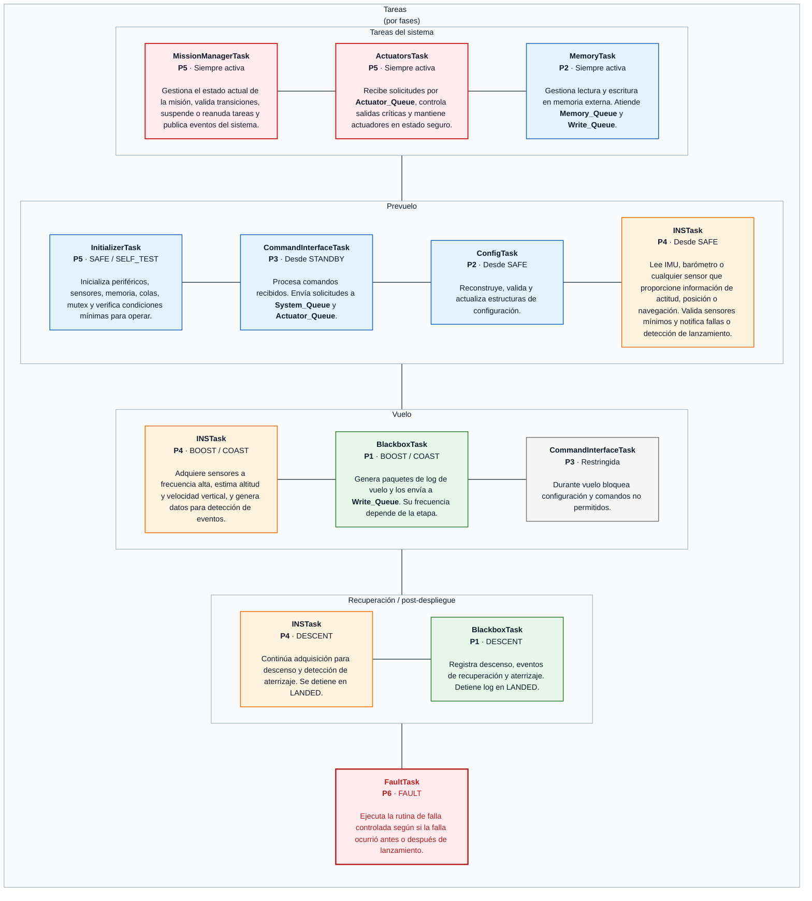
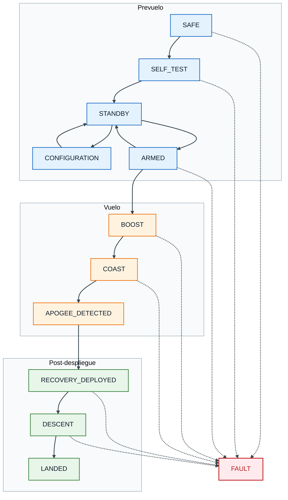
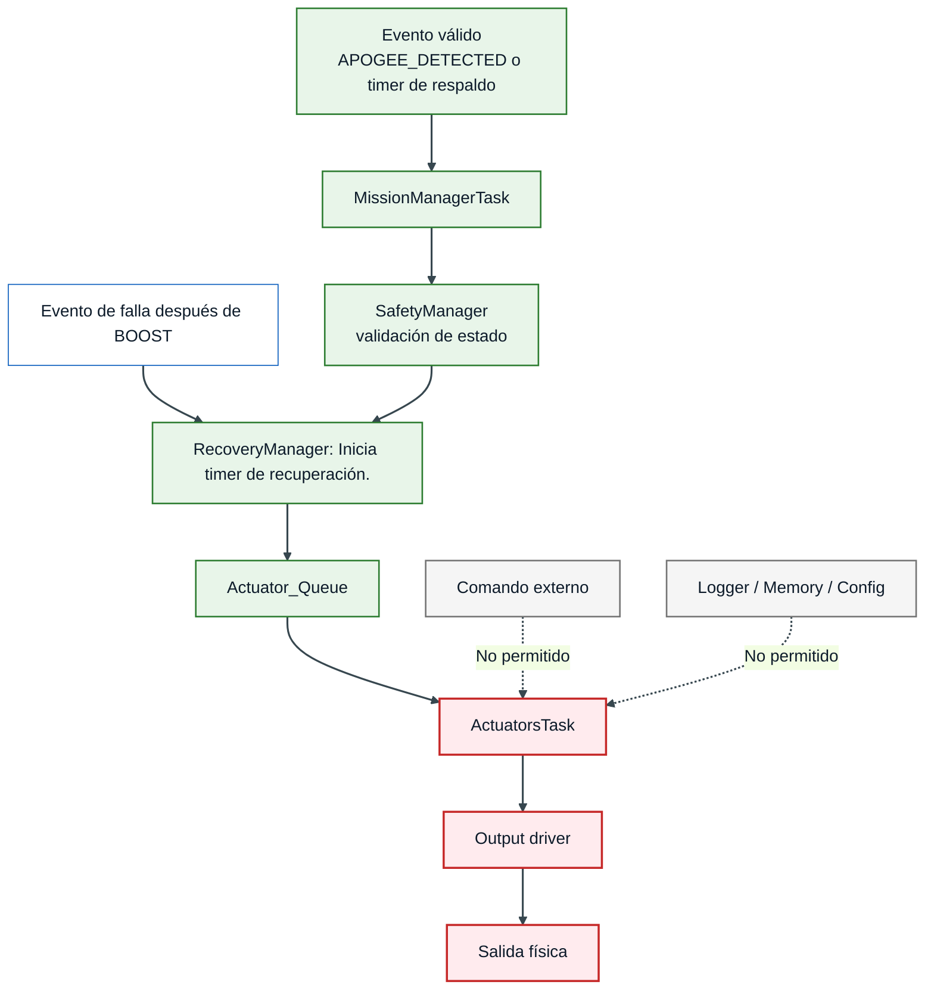
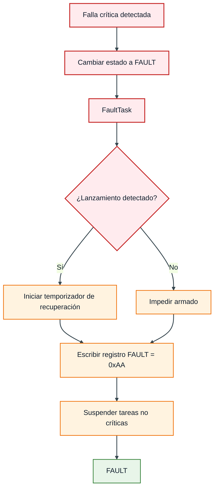
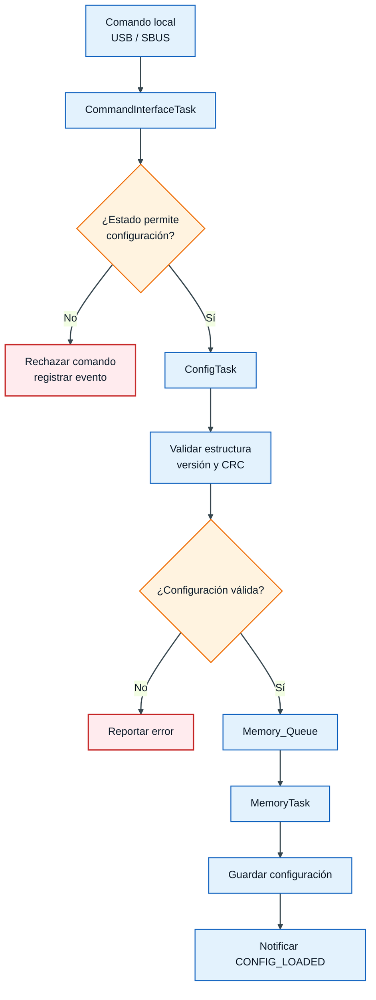

# Arquitectura de Software

**Sistema:** Controladora de Vuelo V2

**Versión:** v0.1

**Fecha:** 12/06/26

**Estado:** Propuesta inicial

---

## **1. Propósito**

Este documento describe la arquitectura de software propuesta para la **Controladora de Vuelo V2**, tomando como base el Concepto de Operaciones y el diagrama preliminar de tareas FreeRTOS.

La arquitectura busca organizar el firmware de forma modular, segura, escalable y verificable. Para ello, el sistema se divide en tareas ejecutadas sobre un sistema operativo en tiempo real, separando las funciones críticas de misión de las funciones auxiliares.

La arquitectura contempla tres grandes fases operativas:

* **Prevuelo**
* **Vuelo**
* **Post-despliegue de recuperación**

Adicionalmente, se define una ruta transversal de falla crítica mediante el estado `FAULT`.

!!! info "Objetivo de arquitectura"
    La arquitectura debe permitir que la controladora ejecute la misión de forma autónoma, sin depender de telemetría, y manteniendo las salidas críticas en estado seguro ante encendido, reset, falla o comandos inválidos.

---

## **2. Alcance**

La arquitectura cubre los siguientes elementos:

* Organización de tareas FreeRTOS.
* Priorización de tareas.
* Comunicación entre tareas.
* Gestión de colas, mutex, eventos y timers.
* Separación de fases operativas.
* Máquina de estados de misión.
* Manejo de fallas.
* Control de actuadores y salidas críticas.
* Registro de datos tipo blackbox.
* Gestión de configuración.
* Gestión de memoria externa.
* Restricción de comandos según estado.

No se incluye en esta versión:

* Telemetría en tiempo real.
* Control activo del vehículo.
* Control de rate, actitud o trayectoria.
* Navegación GNSS.
* Estimación completa de actitud.
* Algoritmos avanzados de guiado o navegación.

!!! warning "Telemetría W.I.P."
    La telemetría se considera una función en desarrollo y no forma parte del alcance mínimo de esta versión.
    La arquitectura deberá mantener un enfoque modular, permitiendo integrarla en el futuro sin modificar la lógica crítica de misión.

---

## **3. Principios de diseño**

La arquitectura se basa en los siguientes principios:

| Principio                        | Descripción                                                                                                                      |
| -------------------------------- | -------------------------------------------------------------------------------------------------------------------------------- |
| Seguridad por defecto            | Después de encendido, reset o falla, las salidas críticas deben permanecer en estado seguro.                                     |
| Máquina de estados centralizada  | El estado de misión solo debe ser modificado por `MissionManagerTask`.                                                           |
| Separación de responsabilidades  | Cada tarea debe tener una responsabilidad clara y limitada.                                                                      |
| Comunicación desacoplada         | Las tareas se comunican mediante colas, eventos o mutex; no mediante acceso directo a variables críticas.                        |
| Activación validada              | Ningún módulo externo debe activar directamente actuadores o salidas pirotécnicas.                                               |
| Configuración bloqueada en vuelo | Los parámetros críticos no deberán modificarse en `ARMED`, `BOOST`, `COAST`, `APOGEE_DETECTED`, `RECOVERY_DEPLOYED` o `DESCENT`. |
| Logging no bloqueante            | El registro de datos no debe bloquear tareas críticas de misión, seguridad o recuperación.                                       |
| Operación autónoma               | La misión debe poder ejecutarse sin estación de tierra ni telemetría.                                                            |
| Escalabilidad                    | Nuevas tareas, como telemetría o GNSS, deben agregarse sin alterar rutas críticas existentes.                                    |

!!! danger "Regla principal"
    Las tareas de comunicación, configuración, logging o memoria no deberán tener acceso directo a salidas críticas. **Toda solicitud de activación deberá pasar por `MissionManagerTask` y `ActuatorsTask`.**

---

## **4. Consideración importante sobre prioridades en FreeRTOS**

En FreeRTOS, por convención, **un número de prioridad mayor representa mayor prioridad de ejecución**. La tarea idle normalmente se ejecuta en prioridad `0`. Para este proyecto se propone la siguiente interpretación de prioridades, asegurando que cada tarea tenga acceso a recursos según su función en el sistema

Ejemplo recomendado:

| Criticidad        | Interpretación                           | Prioridad FreeRTOS sugerida |
| ----------------- | ---------------------------------------- | --------------------------: |
| Crítica inmediata | Seguridad, watchdog, fallas              |                           6 |
| Crítica de misión | Máquina de estados, actuadores, sensores |                           5 |
| Alta              | Eventos de vuelo, recuperación           |                           4 |
| Media             | Comandos                                 |                           3 |
| Baja              | Configuración y manejo de memoria        |                           2 |
| Mínima            | Tareas futuras o no críticas             |                           1 |
| Idle              | Sistema operativo                        |                           0 |

!!! warning "Recomendación"
    Es importante analizar según el concepto de misión y la tabla anterior la prioridad que se le asignará a cada tarea. También es necesario considerar el consumo de recursos de la tarea para evitar que entorpezca tareas críticas que deben ser ejecutadas a tiempos especificos.

---

## **5. Vista general de arquitectura**

Tal como se muestra en la siguiente imagen, la arquitectura esta organizada por fases operativas y tareas del sistema.

 Las tareas del sistema se encargan de monitorear y tomar las decisiones criticas, además de gestionar actuadores y activaciones de cargas pirotecnicas. Gracias a estas funciones es posible monitorear el estado actual del sistema y tener acceso a las configuraciones en todo momento. Como parte de las tareas del sistema también se considera `FaultTask` la cual tiene la mayor prioridad de ejecución, pero a diferencia del resto de tareas del sistema, solo se ejecuta en caso de falla.

 Las fases operativas corresponden a las planteadas en el [concepto de operaciones](conops.md). Solamente se deben ejecutar las tareas necesarias para cada fase y bajo ningún concepto se debe agregar o eliminar tareas de cada fase sin justificar previamente el motivo. 

### **5.1 Tareas y prioridades**

| Tarea                | Grupo                                    | Prioridad                   | Activa en estados          |
| -----------------    | ---------------------------------------- | --------------------------: |--------------------------: |
| [MissionManagerTask](#71-missionmanagertask)   | Tareas del sistema                       |                           5 | Siempre activa             |
| [ActuatorsTask](#73-actuatorstask)        | Tareas del sistema                       |                           5 | Siempre activa             |
| [MemoryTask](#74-memorytask)           | Tareas del sistema                       |                           2 | Siempre activa             |
| [InitializerTask](#75-initializertask)      | Prevuelo                                 |                           5 | `STANDBY` y `SELF_TEST`    |
| [CommandInterfaceTask](#76-commandinterfacetask) | Prevuelo y Vuelo                         |                           3 | Desde `STANDBY` hasta "APOGEE_DETECTED|
| [ConfigTask](#77-configtask)           | Prevuelo                                 |                           2 | `STANDBY`                  |
| [INSTask](#78-instask)              | Prevuelo, Vuelo y recuperación           |                           4 | Desde `SELF_TEST` hasta `DESCENT`|
| [BlackboxTask](#79-blackboxtask)         | Vuelo y recuperación                     |                           1 | Prioridad                  |
| [FaultTask](#72-faulttask)            | Tareas del sistema                       |                           6 | Prioridad                  |

### **5.2 Diagrama de tareas con descripciones**

---

## **6. División operacional por fases**

**El firmware se organiza en tres grupos operativos:**

| Fase            | Estados incluidos                                        | Objetivo                                                                              |
| --------------- | -------------------------------------------------------- | ------------------------------------------------------------------------------------- |
| Prevuelo        | `SAFE`, `SELF_TEST`, `STANDBY`, `CONFIGURATION`, `ARMED` | Preparar el sistema, validar configuración, permitir armado y detectar lanzamiento.   |
| Vuelo           | `BOOST`, `COAST`, `APOGEE_DETECTED`                      | Detectar eventos de vuelo y decidir la recuperación.                                  |
| Post-despliegue | `RECOVERY_DEPLOYED`, `DESCENT`, `LANDED`                 | Ejecutar recuperación, evitar reactivación, registrar descenso y detectar aterrizaje. |
| Falla           | `FAULT`                                                  | Llevar el sistema a una condición segura y bloquear operación normal.                 |

!!! danger "Tareas críticas"
    Durante vuelo no deberán suspenderse:

    * `MissionManagerTask`
    * `FaultTask`
    * `ActuatorsTask`
    * `MemoryTask`
    * `INSTask`

---

## **7. Responsabilidad de cada tarea**

### **7.1 `MissionManagerTask`**

`MissionManagerTask` es la tarea central de la arquitectura. Es responsable de definir el estado actual de la misión y ejecutar las transiciones permitidas.

Responsabilidades:

* Mantener el estado global de misión.
* Recibir eventos desde `System_Queue`.
* Validar transiciones de estado.
* Suspender, reanudar o degradar tareas según fase.
* Solicitar activaciones mediante `Actuator_Queue`.
* Solicitar escritura de eventos críticos en el log mediante `Write_Queue`.
* Bloquear comandos no permitidos en vuelo.
* Coordinar entrada a `FAULT`.

No debe:

* Leer directamente sensores.
* Escribir directamente en memoria externa.
* Activar directamente salidas físicas.
* Procesar directamente comandos USB.

---

### **7.2 `FaultTask`**

`FaultTask` ejecuta la rutina de falla controlada cuando se detecta una condición crítica.

Responsabilidades:

* Recibir e información fallas desde `Fault_Queue`.
* Registrar evento `FAULT_DETECTED`.
* Escribir registro persistente de falla.
* Determinar si la falla ocurrió antes o después de `BOOST`.
* Forzar salidas a estado seguro si la falla ocurre antes de lanzamiento.
* Iniciar recuperación por temporizador si la falla ocurre durante vuelo.
* Bloquear retorno automático a operación normal.

!!! danger "Estado terminal"
    Una vez que el sistema entra en `FAULT`, no deberá volver automáticamente a operación normal.
    La limpieza del registro de falla deberá requerir intervención explícita del operador.

---

### **7.3 `ActuatorsTask`**

`ActuatorsTask` recibe solicitudes de configuración o activación por medio de `Actuator_Queue`.

Responsabilidades:

* Solicitar lectura de registros de configuración de actuadores.
* Inicializar actuadores según configuración.
* Mantener actuadores en estado seguro por defecto.
* Validar que las solicitudes recibidas sean compatibles con el estado actual.
* Ejecutar activación de salidas de recuperación cuando sea autorizado.
* Controlar duración de pulsos.
* Desactivar salidas al finalizar la ventana configurada.
* Bloquear reactivaciones no autorizadas.
* Registrar inicio y fin de activación.

No debe:

* Activar salidas si el sistema no se encuentra en un estado permitido.

---

### **7.4 `MemoryTask`**

`MemoryTask` administra la memoria externa y las solicitudes de lectura/escritura.

Responsabilidades:

* Escribir datos recibidos en `Write_Queue`.
* Atender solicitudes de lectura desde `Memory_Queue`.
* Proteger acceso a memoria mediante `MemoryMutex`.
* Reportar fallas de escritura o lectura.
* Evitar bloqueos largos durante vuelo.

!!! warning "Logging no bloqueante"
    Si la memoria externa falla, la misión no debe detenerse.
    La recuperación y la máquina de estados tienen prioridad sobre el registro de datos.

---

### **7.5 `InitializerTask`**

`InitializerTask` se ejecuta durante `SAFE` y `SELF_TEST`.

Responsabilidades:

* Inicializar periféricos.
* Verificar sensores mínimos.
* Verificar memoria.
* Verificar configuración.
* Confirmar salidas críticas en estado seguro.
* Notificar resultado de autodiagnóstico a `MissionManagerTask`.

Consideraciones:
* Se ejecuta solo durante inicialización.
* Al terminar correctamente puede suspenderse o eliminarse.
* Si detecta falla crítica, debe notificar a `FaultTask`.

---

### **7.6 `CommandInterfaceTask`**

`CommandInterfaceTask` se ejecuta desde `STANDBY` hasta `SELF_TEST`.

Responsabilidades:

* Recibir comandos desde USB, SBUS o LoRa (Cuando disponible).
* Reconstruir paquetes o comandos.
* Validar formato y CRC.
* Enviar comandos permitidos a `System_Queue`.
* Enviar solicitudes de configuración a `ConfigTask`.
* Rechazar comandos no permitidos según estado.
* Bloquear comandos de configuración durante vuelo.

Comandos permitidos por fase:

| Fase                            | Comandos permitidos                                                                              |
| ------------------------------- | ------------------------------------------------------------------------------------------------ |
| `STANDBY`                       | Configuración, lectura de estado, armado si condiciones válidas, lectura y borrado de logs.      |
| `ARMED`                         | Desarmado.                                                                                       |
| `BOOST` / `COAST`               | Emergency recovery deployment.                                                                   |
| `RECOVERY_DEPLOYED` / `DESCENT` | Emergency recovery deployment.                                                                   |
| `LANDED`                        | Descarga de datos y revisión post-vuelo.                                                         |
| `FAULT`                         | Lectura de registro de falla y limpieza controlada autorizada.                                   |

---

### **7.7 `ConfigTask`**

`ConfigTask` gestiona la configuración de misión.

Responsabilidades:

* Leer configuración desde memoria.
* Validar estructura, versión y CRC.
* Actualizar parámetros no críticos.
* Notificar configuración válida o inválida.
* Proveer parámetros a tareas autorizadas.

Parámetros críticos:

* Umbral de lanzamiento.
* Criterios de MECO.
* Criterios de apogeo.
* Tiempo de respaldo para recuperación.
* Tiempo para activar carga pirotecnica.
* Duración de pulso de recuperación.
* Canales de salida habilitados.
* Modo de recuperación (Mecánica o pirotecnia).
* Canal de pirotecnia conectado a sistema de recuperación.
* Frecuencias de logging por fase.
* Valores de PWM para sistemas mecánicos.
* Canales para sistemas mecánicos.
* Canal para servo.

---

### **7.8 `INSTask`**

`INSTask` adquiere información de sensores embarcados.

Responsabilidades:

* Leer IMU.
* Leer barómetro.
* Validar coherencia de muestras.
* Calcular variables derivadas básicas.
* Procesar información de sensores para obtener solución confiable
* Publicar datos en `Sensor_Queue`.
* Reportar fallas a `Fault_Queue`.
* Proveer datos a `FlightEventTask` y `BlackboxTask`.

Variables mínimas esperadas:

| Variable                    | Uso                                                |
| --------------------------- | -------------------------------------------------- |
| Aceleración                 | Detección de lanzamiento, MECO y eventos anómalos. |
| Presión                     | Estimación de altitud.                             |
| Altitud relativa            | Detección de apogeo y aterrizaje.                  |
| Velocidad vertical estimada | Detección de lanzamiento, MECO y apogeo.           |
| Timestamp                   | Sincronización de eventos y logs.                  |

!!! note "Estimación limitada"
    Esta tarea esta contemplada para navegación GNSS y estimación completa de actitud en versiones futuras.
    Sin embargo, la información de actitud o posición absoluta se considera fuera del alcance mínimo de esta versión.

A partir de esta información gestiona eventos de misión:

Responsabilidades:

* Detectar lanzamiento.
* Detectar MECO.
* Detectar apogeo.
* Detectar aterrizaje.
* Aplicar persistencia de muestras.
* Aplicar ventanas temporales.
* Rechazar condiciones físicamente incoherentes.
* Publicar eventos a `System_Queue`.

Eventos generados:

| Evento             | Condición general                                                  |
| ------------------ | ------------------------------------------------------------------ |
| `LAUNCH_DETECTED`  | Al menos dos criterios de lanzamiento válidos.                     |
| `BOOST_END`        | Aceleración o perfil dinámico compatible con fin de empuje.        |
| `APOGEE_DETECTED`  | Velocidad vertical negativa, máximo local o condición de respaldo. |
| `LANDING_DETECTED` | Altitud y velocidad vertical estables.                             |

---

### **7.9 `BlackboxTask`**

`BlackboxTask` genera paquetes de registro y los envía a `Write_Queue`.

Responsabilidades:

* Seleccionar datos según fase.
* Formar paquetes de log.
* Ajustar frecuencia de logging por estado.

Política de logging:

| Fase              | Frecuencia esperada                   |
| ----------------- | ------------------------------------- |
| Prevuelo          | Baja o media.                         |
| Boost             | Alta.                                 |
| Coast             | Alta o media.                         |
| Recovery deployed | Media.                                |
| Descent           | Media o baja.                         |
| Landed            | Cierre de archivo o detención de log. |

!!! warning "Prioridad de misión"
    `BlackboxTask` no debe bloquear ninguna tarea.

---

## **8. Comunicación entre tareas**

La comunicación entre tareas debe realizarse mediante colas, eventos, mutex y timers. Se evita el acceso directo entre módulos para reducir acoplamiento.

| Recurso          | Tipo          | Productor                                                          | Consumidor                        | Uso                                             |
| ---------------- | ------------- | ------------------------------------------------------------------ | --------------------------------- | ----------------------------------------------- |
| `System_Queue`   | Cola          | `CommandInterfaceTask`, `INSTask`, `InitializerTask`       | `MissionManagerTask`              | Eventos de sistema y solicitudes de transición. |
| `Actuator_Queue` | Cola          | `MissionManagerTask`, `FaultTask`                                  | `ActuatorsTask`                   | Solicitudes de actuadores y recuperación.       |
| `Write_Queue`    | Cola          | `MissionManagerTask`, `BlackboxTask`, `FaultTask`, `ActuatorsTask` | `MemoryTask`                      | Escritura de logs y eventos.                    |
| `Memory_Queue`   | Cola          | `ConfigTask`, `CommandInterfaceTask`                               | `MemoryTask`                      | Solicitudes de lectura de memoria.              |
| `MemoryMutex`    | Mutex         | `MemoryTask`                                                       | `ActuatorsTask`, `ConfigTask`, `InitializerTask`             | Protección de acceso a memoria.                 |

---

## **9. Gestión de fases y suspensión de tareas**

`MissionManagerTask` será responsable de modificar el modo de ejecución de tareas según el estado de misión.

Acciones permitidas:

* Reanudar tareas necesarias.
* Suspender tareas no críticas.
* Reducir frecuencia de tareas auxiliares.
* Bloquear comandos externos.
* Cambiar perfil de logging.
* Activar timers de respaldo.
* Publicar flags de estado.

Ejemplo de política:

| Transición                              | Acción arquitectónica                                                  |
| --------------------------------------- | ---------------------------------------------------------------------- |
| `SAFE` → `SELF_TEST`                    | Ejecutar `InitializerTask`, validar memoria, sensores y configuración. |
| `SELF_TEST` → `STANDBY`                 | Suspender `InitializerTask`, habilitar comandos locales.               |
| `STANDBY` → `ARMED`                     | Bloquear configuración crítica y preparar detección de lanzamiento.    |
| `ARMED` → `BOOST`                       | Restringir comandos, aumentar logging, habilitar detección de MECO.    |
| `BOOST` → `COAST`                       | Habilitar lógica de apogeo y temporizador de respaldo.                 |
| `COAST` → `APOGEE_DETECTED`             | Solicitar recuperación validada.                                       |
| `APOGEE_DETECTED` → `RECOVERY_DEPLOYED` | Ejecutar pulso de recuperación y bloquear reactivación.                |
| `RECOVERY_DEPLOYED` → `DESCENT`         | Reducir logging y habilitar detección de aterrizaje.                   |
| `DESCENT` → `LANDED`                    | Detener log de vuelo y permitir post-vuelo.                            |
| Cualquier estado → `FAULT`              | Ejecutar rutina de falla controlada.                                   |

---

## **10. Arquitectura de actuadores y salidas críticas**

Las salidas críticas incluyen cargas pirotécnicas, actuadores de recuperación o cualquier salida capaz de modificar físicamente el estado del vehículo.

### **10.1 Ruta válida de activación**

### **10.2 Reglas de seguridad**

* Las salidas críticas inician en estado seguro.
* Las salidas críticas no se activan durante `SAFE`, `SELF_TEST`, `STANDBY` o `CONFIGURATION`.
* El estado `ARMED` habilita la lógica de misión, pero no activa salidas.
* La recuperación solo puede activarse después de `APOGEE_DETECTED` o condición de respaldo válida.
* Después de `RECOVERY_DEPLOYED`, la salida queda bloqueada contra reactivación no autorizada.
* En `FAULT`, las salidas pasan a estado seguro, salvo secuencia de recuperación de emergencia posterior a lanzamiento.
* El sistema de recuperación solo debe ser activado por medio del timer ´DeployParachute´ y solo las tareas ´DeployParachute´ y ´FaultTask´
---

## 11. Arquitectura de falla controlada

El estado `FAULT` se considera una condición terminal. Su comportamiento depende de si la falla ocurrió antes o después de detectar lanzamiento.

### Registro persistente de falla

El sistema utilizará un registro persistente en memoria interna para indicar una falla crítica latente.

| Valor  | Significado                       |
| ------ | --------------------------------- |
| `0x00` | Sin falla crítica registrada.     |
| `0xAA` | Falla crítica registrada.         |

---

## **12. Arquitectura de memoria y blackbox**

La arquitectura separa la generación de paquetes de log de la escritura física en memoria.

### **12.1 Flujo**

1. `BlackboxTask` obtiene estado actual, sensores y eventos.
2. Forma paquetes de log.
3. Envía paquetes a `Write_Queue`.
4. `MemoryTask` escribe los paquetes en memoria externa.
5. Si ocurre falla de memoria, `MemoryTask` notifica a `Fault_Queue` o registra una advertencia degradada.

### **12.2 Reglas**

* `BlackboxTask` no escribe directamente en memoria.
* `MemoryTask` es la única tarea con acceso al driver de memoria externa.
* El acceso a memoria se protege mediante `MemoryMutex`.
* La escritura de logs no debe bloquear ninguna tarea.
* Debe haber espacio designado para logs de eventos y blackbox, para permitir la escritura de logs incluso con memoria llena. 

---

## **13. Arquitectura de configuración**

La configuración define parámetros operativos de la misión. Solo debe poder modificarse en fases permitidas.

### Flujo de configuración

### **13.1 Reglas de configuración**

* La configuración crítica solo puede modificarse en ´STANDBY´.
* Toda configuración debe tener versión.
* Toda configuración debe tener CRC o mecanismo equivalente de integridad.
* Si la configuración es inválida, el sistema no debe permitir armado.

---

## **14. Política de comandos**

Los comandos externos deben ser tratados como solicitudes, no como acciones directas.

| Comando                | SAFE       | STANDBY    | ARMED | BOOST / COAST   | DESCENT         | LANDED          | FAULT      |
| ---------------------- | ---------- | ---------- | ----- | -------------   | -----------     | ----------      | ---------- |
| Leer estado            | Sí         | Sí         | Sí    | Restringido     | Restringido     | No              | Sí         |
| Configurar parámetros  | Sí         | Sí         | No    | No              | No              | No              | No         |
| Eliminar logs          | Sí         | Sí         | No    | No              | No              | No              | No         |
| Armar                  | No         | Sí         | No    | No              | No              | No              | No         |
| Desarmar               | No         | No         | Sí    | No              | No              | No              | No         |
| Activar salida crítica | No         | No         | Con confirmación| Con confirmación| No    | No              | No         |
| Leer registro FAULT    | Sí         | Sí         | Sí    | Restringido     | Restringido     | No              | Sí         |
| Limpiar registro FAULT | Autorizado | No         | No    | No              | No              | No              | Autorizado |

!!! danger "Comandos externos"
    El comando para activación de salida crítica solo es admisible si se envío previamente el comando de armado y si está habilitado en la configuración. 

---

## **15. Manejo de reset**

Después de cualquier reset, el sistema debe iniciar en una condición segura.

Secuencia mínima:

1. Inicializar hardware mínimo.
2. Forzar salidas críticas a estado seguro.
3. Inicializar RTOS y recursos estáticos.
4. Leer registro persistente de falla.
5. Si el registro contiene `0xAA`, entrar a `FAULT`.
6. Cargar configuración.
7. Ejecutar autodiagnóstico.
8. Permitir `STANDBY` únicamente si no hay falla crítica.

!!! danger "Reset seguro"
    Ningún reset deberá causar activación automática de salidas críticas. Se debe prevenir cualquier reinicio después de que se haya pasado por el estado ´BOOST´ y en su defecto deberá entrar a la rutina de falla controlada. Bajo ningún concepto la aeronave puede ignorar la secuencia de inicialización segura.

---

## **16. Timers**

| Timer                     | Uso                                                    | Activación                 |
| ------------------------- | ------------------------------------------------------ | -------------------------- |
| `LaunchDetectWindowTimer` | Validar persistencia de lanzamiento.                   | `ARMED`                    |
| `ApogeeBackupTimer`       | Activar recuperación si no se detecta apogeo.          | `COAST`                    |
| `DeployParachute`         | Inicia la secuencia de despliegue de paracaidas.       | `APOGEE_DETECTED` y `FAULT`|

---

## **17. Historial de cambios**

| Versión | Fecha     | Descripción                                                            | Autor             |
| ------- | --------- | ---------------------------------------------------------------------- | ----------------- |
| v0.1    | 12/06/26  | Propusta inicial de arquitectura                                     . | Christian de Alba |
