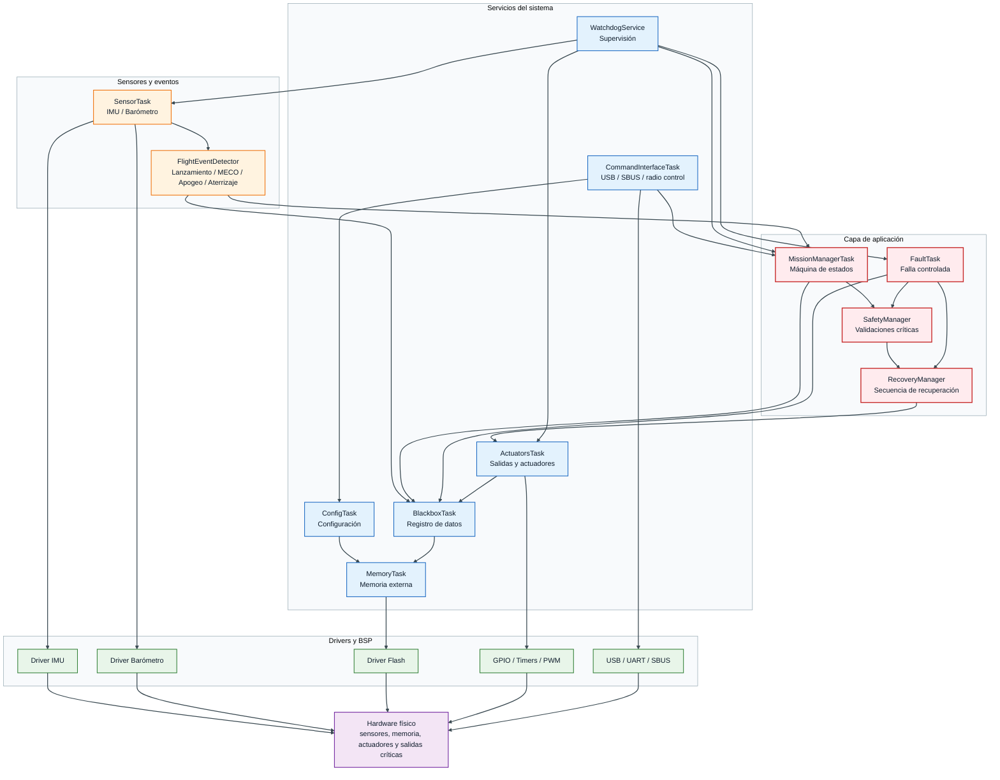
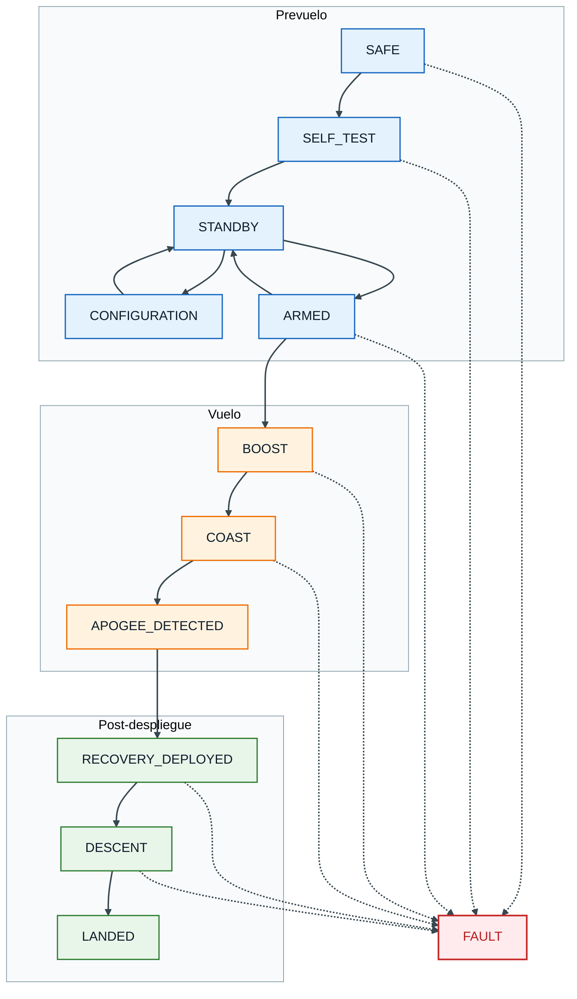
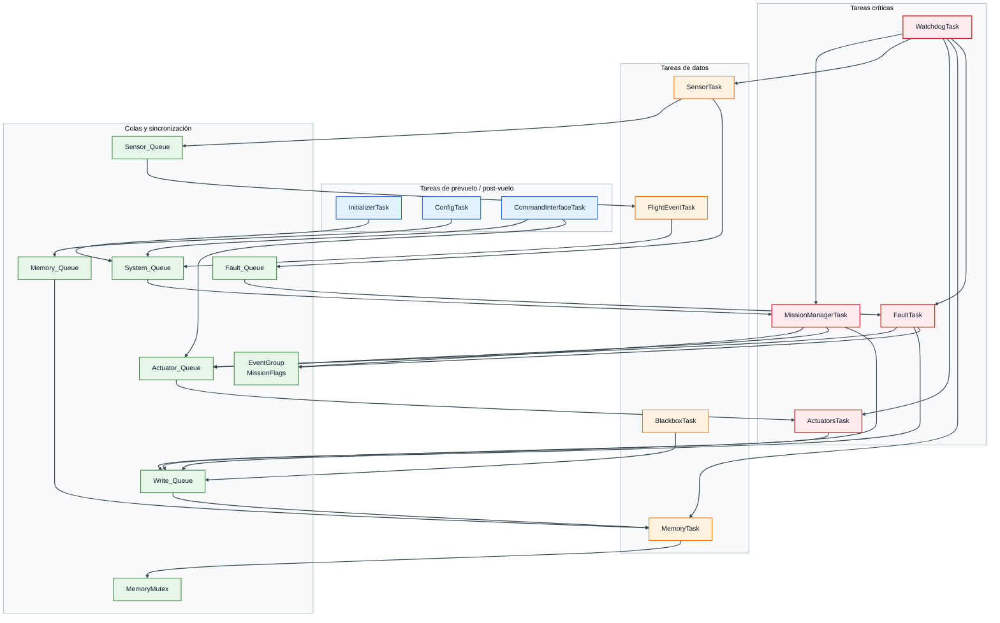
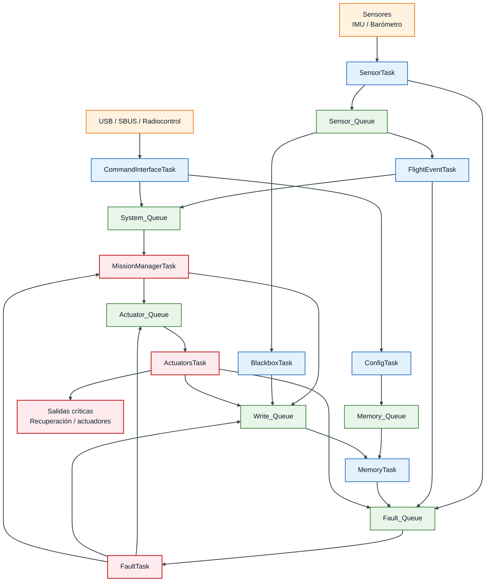
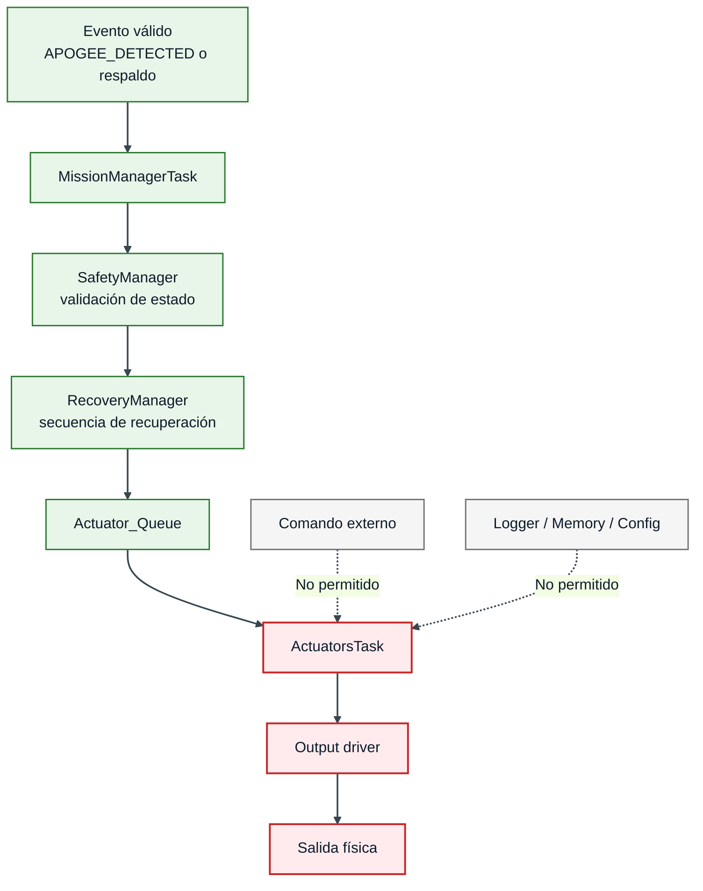
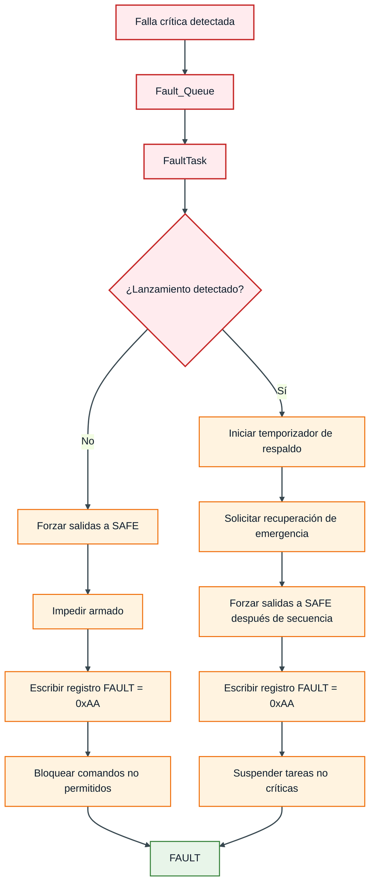
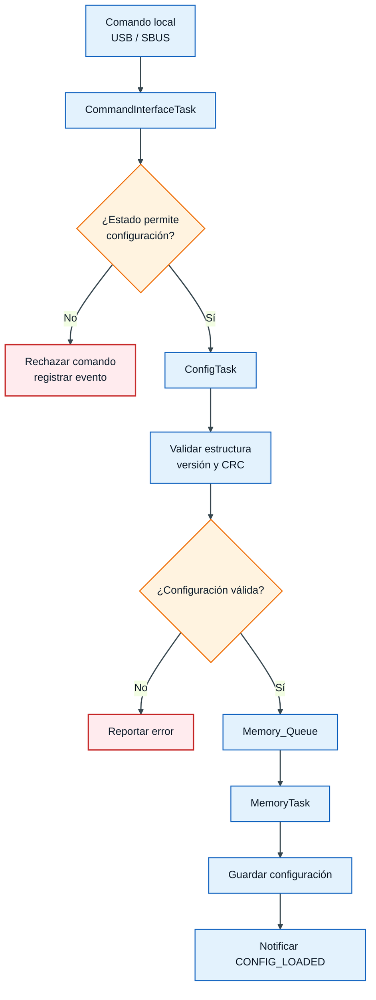

---

title: Arquitectura de Software
description: Arquitectura de software basada en FreeRTOS para la Controladora de Vuelo V2
-----------------------------------------------------------------------------------------

# Arquitectura de Software

**Sistema:** Controladora de Vuelo V2
**Versión:** v0.1
**Fecha:** Pendiente
**Estado:** Borrador técnico

---

## 1. Propósito

Este documento describe la arquitectura de software propuesta para la **Controladora de Vuelo V2**, tomando como base el Concepto de Operaciones y el diagrama preliminar de tareas FreeRTOS.

La arquitectura busca organizar el firmware de forma modular, segura, escalable y verificable. Para ello, el sistema se divide en tareas ejecutadas sobre un sistema operativo en tiempo real, separando las funciones críticas de misión de las funciones auxiliares.

La arquitectura contempla tres grandes fases operativas:

* **Prevuelo**
* **Vuelo**
* **Post-despliegue de recuperación**

Adicionalmente, se define una ruta transversal de falla crítica mediante el estado `FAULT`.

!!! info "Objetivo de arquitectura"
La arquitectura debe permitir que la controladora ejecute la misión de forma autónoma, sin depender de telemetría, y manteniendo las salidas críticas en estado seguro ante encendido, reset, falla o comandos inválidos.

---

## 2. Alcance

La arquitectura cubre los siguientes elementos:

* Organización de tareas FreeRTOS.
* Priorización de tareas.
* Comunicación entre tareas.
* Gestión de colas, mutex, eventos y timers.
* Separación de fases operativas.
* Máquina de estados de misión.
* Manejo de fallas.
* Control de actuadores y salidas críticas.
* Registro de datos tipo blackbox.
* Gestión de configuración.
* Gestión de memoria externa.
* Restricción de comandos según estado.

No se incluye en esta versión:

* Telemetría en tiempo real.
* Control activo del vehículo.
* Control de rate, actitud o trayectoria.
* Navegación GNSS.
* Estimación completa de actitud.
* Algoritmos avanzados de guiado o navegación.

!!! warning "Telemetría W.I.P."
La telemetría se considera una función en desarrollo y no forma parte del alcance mínimo de esta versión.

```
La arquitectura deberá permitir integrarla en el futuro sin modificar la lógica crítica de misión.
```

---

## 3. Principios de diseño

La arquitectura se basa en los siguientes principios:

| Principio                        | Descripción                                                                                                                      |
| -------------------------------- | -------------------------------------------------------------------------------------------------------------------------------- |
| Seguridad por defecto            | Después de encendido, reset o falla, las salidas críticas deben permanecer en estado seguro.                                     |
| Máquina de estados centralizada  | El estado de misión solo debe ser modificado por `MissionManagerTask`.                                                           |
| Separación de responsabilidades  | Cada tarea debe tener una responsabilidad clara y limitada.                                                                      |
| Comunicación desacoplada         | Las tareas se comunican mediante colas, eventos o mutex; no mediante acceso directo a variables críticas.                        |
| Activación validada              | Ningún módulo externo debe activar directamente actuadores o salidas pirotécnicas.                                               |
| Configuración bloqueada en vuelo | Los parámetros críticos no deberán modificarse en `ARMED`, `BOOST`, `COAST`, `APOGEE_DETECTED`, `RECOVERY_DEPLOYED` o `DESCENT`. |
| Logging no bloqueante            | El registro de datos no debe bloquear tareas críticas de misión, seguridad o recuperación.                                       |
| Operación autónoma               | La misión debe poder ejecutarse sin estación de tierra ni telemetría.                                                            |
| Escalabilidad                    | Nuevas tareas, como telemetría o GNSS, deben agregarse sin alterar rutas críticas existentes.                                    |

!!! danger "Regla principal"
Las tareas de comunicación, configuración, logging o memoria no deberán tener acceso directo a salidas críticas.

```
Toda solicitud de activación deberá pasar por `MissionManagerTask`, `SafetyManager` y `ActuatorsTask`.
```

---

## 4. Consideración importante sobre prioridades en FreeRTOS

En FreeRTOS, por convención, **un número de prioridad mayor representa mayor prioridad de ejecución**. La tarea idle normalmente se ejecuta en prioridad `0`.

En el diagrama preliminar se utiliza una escala donde `Mission Manager` tiene prioridad `0`, `FAULT TASK` prioridad `1`, `ACTUATORS TASK` prioridad `2`, etc. Esta escala puede interpretarse como una prioridad conceptual donde el número menor indica mayor criticidad.

Para evitar ambigüedad, en esta arquitectura se recomienda usar dos columnas:

| Concepto           | Descripción                              |
| ------------------ | ---------------------------------------- |
| Criticidad         | Nivel lógico de importancia de la tarea. |
| Prioridad FreeRTOS | Valor real asignado en el RTOS.          |

Ejemplo recomendado:

| Criticidad        | Interpretación                           | Prioridad FreeRTOS sugerida |
| ----------------- | ---------------------------------------- | --------------------------: |
| Crítica inmediata | Seguridad, watchdog, fallas              |                           6 |
| Crítica de misión | Máquina de estados, actuadores, sensores |                           5 |
| Alta              | Eventos de vuelo, recuperación           |                           4 |
| Media             | Logging y memoria                        |                           3 |
| Baja              | Comandos, configuración                  |                           2 |
| Mínima            | Tareas futuras o no críticas             |                           1 |
| Idle              | Sistema operativo                        |                           0 |

!!! warning "Recomendación"
No se recomienda usar directamente `Prioridad: 0` para `MissionManagerTask` en FreeRTOS, porque podría ejecutarse con la misma prioridad que la tarea idle.

```
Si se desea conservar la escala conceptual del diagrama, se recomienda crear una capa de mapeo con `#define` o `enum`.
```

---

## 5. Vista general de arquitectura

La arquitectura se organiza en capas. Las capas superiores contienen la lógica de misión y seguridad, mientras que las inferiores encapsulan drivers, periféricos y hardware.



---

## 6. División operacional por fases

El firmware se organiza en tres grupos operativos:

| Fase            | Estados incluidos                                        | Objetivo                                                                              |
| --------------- | -------------------------------------------------------- | ------------------------------------------------------------------------------------- |
| Prevuelo        | `SAFE`, `SELF_TEST`, `STANDBY`, `CONFIGURATION`, `ARMED` | Preparar el sistema, validar configuración, permitir armado y detectar lanzamiento.   |
| Vuelo           | `BOOST`, `COAST`, `APOGEE_DETECTED`                      | Detectar eventos de vuelo y decidir la recuperación.                                  |
| Post-despliegue | `RECOVERY_DEPLOYED`, `DESCENT`, `LANDED`                 | Ejecutar recuperación, evitar reactivación, registrar descenso y detectar aterrizaje. |
| Falla           | `FAULT`                                                  | Llevar el sistema a una condición segura y bloquear operación normal.                 |



---

## 7. Tareas principales

La arquitectura se compone de tareas FreeRTOS. Cada tarea tiene una responsabilidad definida y una política de activación según la fase de misión.

| Tarea                  | Responsabilidad principal                                | Activación                                   |
| ---------------------- | -------------------------------------------------------- | -------------------------------------------- |
| `MissionManagerTask`   | Gestionar el estado de misión y coordinar transiciones.  | Siempre activa.                              |
| `FaultTask`            | Ejecutar rutina de falla controlada.                     | Activa por evento o notificación crítica.    |
| `ActuatorsTask`        | Controlar actuadores y salidas críticas.                 | Siempre activa, pero bloqueada por estado.   |
| `MemoryTask`           | Gestionar lectura/escritura en memoria externa.          | Siempre activa o suspendible según fase.     |
| `InitializerTask`      | Inicializar hardware, periféricos y servicios.           | Solo `SAFE` / `SELF_TEST`.                   |
| `CommandInterfaceTask` | Procesar comandos de USB, SBUS o radio control.          | Prevuelo y post-vuelo; restringida en vuelo. |
| `ConfigTask`           | Leer, escribir y validar configuración.                  | Prevuelo.                                    |
| `SensorTask`           | Adquirir datos de IMU, barómetro y sensores disponibles. | Desde `SELF_TEST` hasta `LANDED`.            |
| `FlightEventTask`      | Detectar lanzamiento, MECO, apogeo y aterrizaje.         | Desde `ARMED` hasta `LANDED`.                |
| `BlackboxTask`         | Formar paquetes de log y enviarlos a escritura.          | Desde `STANDBY` hasta `LANDED`.              |
| `WatchdogTask`         | Supervisar ejecución de tareas críticas.                 | Siempre activa.                              |

!!! note "Cambio de nombre recomendado"
En el diagrama preliminar aparece `INS Task`.

```
Para esta versión del sistema, donde no se incluye estimación completa de actitud, GNSS ni navegación, se recomienda renombrarla como `SensorTask` o `SensorAcquisitionTask`.

Si en el futuro se integra un INS externo, este puede agregarse como driver o submódulo dentro de `SensorManager`.
```

---

## 8. Diagrama RTOS propuesto



---

## 9. Responsabilidad de cada tarea

### 9.1 `MissionManagerTask`

`MissionManagerTask` es la tarea central de la arquitectura. Es responsable de definir el estado actual de la misión y ejecutar las transiciones permitidas.

Responsabilidades:

* Mantener el estado global de misión.
* Recibir eventos desde `System_Queue`.
* Validar transiciones de estado.
* Suspender, reanudar o degradar tareas según fase.
* Solicitar activaciones mediante `Actuator_Queue`.
* Solicitar escritura de eventos críticos mediante `Write_Queue`.
* Bloquear comandos no permitidos en vuelo.
* Coordinar entrada a `FAULT`.

No debe:

* Leer directamente sensores.
* Escribir directamente en memoria externa.
* Activar directamente salidas físicas.
* Procesar directamente comandos USB complejos.

---

### 9.2 `FaultTask`

`FaultTask` ejecuta la rutina de falla controlada cuando se detecta una condición crítica.

Responsabilidades:

* Recibir fallas desde `Fault_Queue`.
* Clasificar fallas críticas y no críticas.
* Registrar evento `FAULT_DETECTED`.
* Escribir registro persistente de falla.
* Determinar si la falla ocurrió antes o después de `BOOST`.
* Forzar salidas a estado seguro si la falla ocurre antes de lanzamiento.
* Iniciar recuperación por temporizador si la falla ocurre durante vuelo.
* Bloquear retorno automático a operación normal.

!!! danger "Estado terminal"
Una vez que el sistema entra en `FAULT`, no deberá volver automáticamente a operación normal.

```
La limpieza del registro de falla deberá requerir intervención explícita del operador.
```

---

### 9.3 `ActuatorsTask`

`ActuatorsTask` recibe solicitudes de configuración o activación por medio de `Actuator_Queue`.

Responsabilidades:

* Mantener actuadores en estado seguro por defecto.
* Validar que las solicitudes recibidas sean compatibles con el estado actual.
* Ejecutar activación de salidas de recuperación cuando sea autorizado.
* Controlar duración de pulsos.
* Desactivar salidas al finalizar la ventana configurada.
* Bloquear reactivaciones no autorizadas.
* Registrar inicio y fin de activación.

No debe:

* Aceptar comandos directos desde USB, SBUS o radio.
* Activar salidas si el sistema no se encuentra en un estado permitido.
* Reactivar recuperación sin una solicitud explícita y validada.

---

### 9.4 `MemoryTask`

`MemoryTask` administra la memoria externa y las solicitudes de lectura/escritura.

Responsabilidades:

* Leer configuración desde memoria.
* Escribir datos recibidos en `Write_Queue`.
* Atender solicitudes de lectura desde `Memory_Queue`.
* Proteger acceso a memoria mediante `MemoryMutex`.
* Reportar fallas de escritura o lectura.
* Evitar bloqueos largos durante vuelo.

!!! warning "Logging no bloqueante"
Si la memoria externa falla, la misión no debe detenerse.

```
La recuperación y la máquina de estados tienen prioridad sobre el registro de datos.
```

---

### 9.5 `InitializerTask`

`InitializerTask` se ejecuta durante `SAFE` y `SELF_TEST`.

Responsabilidades:

* Inicializar periféricos.
* Verificar sensores mínimos.
* Verificar memoria.
* Verificar configuración.
* Confirmar salidas críticas en estado seguro.
* Inicializar colas, mutex, timers y servicios RTOS.
* Notificar resultado de autodiagnóstico a `MissionManagerTask`.

Política:

* Se ejecuta solo durante inicialización.
* Al terminar correctamente puede suspenderse o eliminarse.
* Si detecta falla crítica, debe notificar a `FaultTask`.

---

### 9.6 `CommandInterfaceTask`

`CommandInterfaceTask` sustituye el concepto de `Radio Task` para evitar confusión con telemetría.

Responsabilidades:

* Recibir comandos desde USB, SBUS o radiocontrol.
* Reconstruir paquetes o comandos.
* Validar formato y CRC, si aplica.
* Enviar comandos permitidos a `System_Queue`.
* Enviar solicitudes de configuración a `ConfigTask`.
* Rechazar comandos no permitidos según estado.
* Bloquear comandos de configuración durante vuelo.

Comandos permitidos por fase:

| Fase                            | Comandos permitidos                                              |
| ------------------------------- | ---------------------------------------------------------------- |
| `SAFE` / `STANDBY`              | Configuración, lectura de estado, armado si condiciones válidas. |
| `CONFIGURATION`                 | Lectura/escritura de parámetros.                                 |
| `ARMED`                         | Desarmado, lectura de estado limitada.                           |
| `BOOST` / `COAST`               | Comandos bloqueados o restringidos.                              |
| `RECOVERY_DEPLOYED` / `DESCENT` | Comandos bloqueados o restringidos.                              |
| `LANDED`                        | Descarga de datos y revisión post-vuelo.                         |
| `FAULT`                         | Lectura de registro de falla y limpieza controlada autorizada.   |

---

### 9.7 `ConfigTask`

`ConfigTask` gestiona la configuración de misión.

Responsabilidades:

* Leer configuración desde memoria.
* Validar estructura, versión y CRC.
* Actualizar parámetros no críticos.
* Bloquear escritura de parámetros críticos durante vuelo.
* Notificar configuración válida o inválida.
* Proveer parámetros a tareas autorizadas.

Parámetros críticos:

* Umbral de lanzamiento.
* Criterios de MECO.
* Criterios de apogeo.
* Tiempo de respaldo para recuperación.
* Duración de pulso de recuperación.
* Canales de salida habilitados.
* Modo de armado.
* Frecuencias de logging por fase.

---

### 9.8 `SensorTask`

`SensorTask` adquiere información de sensores embarcados.

Responsabilidades:

* Leer IMU.
* Leer barómetro.
* Validar coherencia de muestras.
* Calcular variables derivadas básicas.
* Publicar datos en `Sensor_Queue`.
* Reportar fallas a `Fault_Queue`.
* Proveer datos a `FlightEventTask` y `BlackboxTask`.

Variables mínimas esperadas:

| Variable                    | Uso                                                |
| --------------------------- | -------------------------------------------------- |
| Aceleración                 | Detección de lanzamiento, MECO y eventos anómalos. |
| Presión                     | Estimación de altitud.                             |
| Altitud relativa            | Detección de apogeo y aterrizaje.                  |
| Velocidad vertical estimada | Detección de lanzamiento, MECO y apogeo.           |
| Timestamp                   | Sincronización de eventos y logs.                  |

!!! note "Estimación limitada"
Esta tarea no implica navegación GNSS ni estimación completa de actitud.

```
La información de actitud o posición absoluta se considera fuera del alcance mínimo de esta versión.
```

---

### 9.9 `FlightEventTask`

`FlightEventTask` detecta eventos de misión usando los datos publicados por `SensorTask`.

Responsabilidades:

* Detectar lanzamiento.
* Detectar MECO.
* Detectar apogeo.
* Detectar aterrizaje.
* Aplicar persistencia de muestras.
* Aplicar ventanas temporales.
* Rechazar condiciones físicamente incoherentes.
* Publicar eventos a `System_Queue`.

Eventos generados:

| Evento             | Condición general                                                  |
| ------------------ | ------------------------------------------------------------------ |
| `LAUNCH_DETECTED`  | Al menos dos criterios de lanzamiento válidos.                     |
| `BOOST_END`        | Aceleración o perfil dinámico compatible con fin de empuje.        |
| `APOGEE_DETECTED`  | Velocidad vertical negativa, máximo local o condición de respaldo. |
| `LANDING_DETECTED` | Altitud y velocidad vertical estables.                             |

---

### 9.10 `BlackboxTask`

`BlackboxTask` genera paquetes de registro y los envía a `Write_Queue`.

Responsabilidades:

* Seleccionar datos según fase.
* Formar paquetes de log.
* Registrar eventos críticos.
* Ajustar frecuencia de logging por estado.
* Reducir frecuencia durante descenso, si aplica.
* Solicitar cierre de log al detectar `LANDED`.

Política de logging:

| Fase              | Frecuencia esperada                   |
| ----------------- | ------------------------------------- |
| Prevuelo          | Baja o media.                         |
| Boost             | Alta.                                 |
| Coast             | Alta o media.                         |
| Recovery deployed | Media.                                |
| Descent           | Media o baja.                         |
| Landed            | Cierre de archivo o detención de log. |

!!! warning "Prioridad de misión"
`BlackboxTask` no debe bloquear a `MissionManagerTask`, `FaultTask`, `SensorTask` ni `ActuatorsTask`.

---

### 9.11 `WatchdogTask`

`WatchdogTask` supervisa que las tareas críticas sigan ejecutándose dentro del tiempo esperado.

Responsabilidades:

* Recibir heartbeat de tareas críticas.
* Validar que las tareas críticas no estén bloqueadas.
* Refrescar watchdog de hardware.
* Reportar falla si una tarea crítica deja de responder.
* Forzar reset controlado si el sistema no puede recuperarse.

Tareas monitoreadas:

* `MissionManagerTask`
* `FaultTask`
* `ActuatorsTask`
* `SensorTask`
* `FlightEventTask`
* `MemoryTask`, si se requiere durante vuelo.

---

## 10. Comunicación entre tareas

La comunicación entre tareas debe realizarse mediante colas, eventos, mutex y timers. Se evita el acceso directo entre módulos para reducir acoplamiento.

| Recurso          | Tipo          | Productor                                                          | Consumidor                        | Uso                                             |
| ---------------- | ------------- | ------------------------------------------------------------------ | --------------------------------- | ----------------------------------------------- |
| `System_Queue`   | Cola          | `CommandInterfaceTask`, `FlightEventTask`, `InitializerTask`       | `MissionManagerTask`              | Eventos de sistema y solicitudes de transición. |
| `Actuator_Queue` | Cola          | `MissionManagerTask`, `FaultTask`                                  | `ActuatorsTask`                   | Solicitudes de actuadores y recuperación.       |
| `Write_Queue`    | Cola          | `MissionManagerTask`, `BlackboxTask`, `FaultTask`, `ActuatorsTask` | `MemoryTask`                      | Escritura de logs y eventos.                    |
| `Memory_Queue`   | Cola          | `ConfigTask`, `CommandInterfaceTask`                               | `MemoryTask`                      | Solicitudes de lectura de memoria.              |
| `Fault_Queue`    | Cola          | Cualquier tarea crítica                                            | `FaultTask`                       | Reporte de fallas.                              |
| `Sensor_Queue`   | Cola o buffer | `SensorTask`                                                       | `FlightEventTask`, `BlackboxTask` | Datos de sensores.                              |
| `MissionFlags`   | Event group   | `MissionManagerTask`, `FaultTask`                                  | Tareas del sistema                | Sincronización por estado.                      |
| `MemoryMutex`    | Mutex         | `MemoryTask`                                                       | `MemoryTask` / drivers            | Protección de acceso a memoria.                 |

---

## 11. Flujo de información



---

## 12. Activación de tareas por fase

| Tarea                  | SAFE       | SELF_TEST  | STANDBY    | CONFIGURATION | ARMED         | BOOST                | COAST                | APOGEE_DETECTED  | RECOVERY_DEPLOYED | DESCENT             | LANDED            | FAULT                              |
| ---------------------- | ---------- | ---------- | ---------- | ------------- | ------------- | -------------------- | -------------------- | ---------------- | ----------------- | ------------------- | ----------------- | ---------------------------------- |
| `MissionManagerTask`   | Activa     | Activa     | Activa     | Activa        | Activa        | Activa               | Activa               | Activa           | Activa            | Activa              | Activa            | Activa                             |
| `FaultTask`            | Espera     | Espera     | Espera     | Espera        | Espera        | Espera               | Espera               | Espera           | Espera            | Espera              | Espera            | Activa                             |
| `ActuatorsTask`        | Safe       | Safe       | Safe       | Safe          | Armada lógica | Bloqueada            | Lista                | Activa           | Control pulso     | Safe                | Safe              | Safe / recuperación                |
| `MemoryTask`           | Activa     | Activa     | Activa     | Activa        | Activa        | Activa no bloqueante | Activa no bloqueante | Activa           | Activa            | Activa              | Cierre            | Registro falla                     |
| `InitializerTask`      | Activa     | Activa     | Suspendida | Suspendida    | Suspendida    | Suspendida           | Suspendida           | Suspendida       | Suspendida        | Suspendida          | Suspendida        | Suspendida                         |
| `CommandInterfaceTask` | Limitada   | Limitada   | Activa     | Activa        | Restringida   | Bloqueada            | Bloqueada            | Bloqueada        | Bloqueada         | Bloqueada           | Activa            | Solo comandos permitidos           |
| `ConfigTask`           | Activa     | Activa     | Activa     | Activa        | Bloqueada     | Suspendida           | Suspendida           | Suspendida       | Suspendida        | Suspendida          | Activa            | Solo lectura / limpieza autorizada |
| `SensorTask`           | Inicial    | Activa     | Activa     | Activa        | Activa        | Alta frecuencia      | Alta frecuencia      | Activa           | Activa            | Frecuencia reducida | Baja / suspendida | Según condición                    |
| `FlightEventTask`      | Suspendida | Suspendida | Suspendida | Suspendida    | Launch detect | MECO detect          | Apogee detect        | Recovery request | Landing prep      | Landing detect      | Suspendida        | Suspendida                         |
| `BlackboxTask`         | Baja       | Baja       | Media      | Media         | Media         | Alta                 | Alta                 | Evento           | Media             | Baja                | Cierre            | Evento falla                       |
| `WatchdogTask`         | Activa     | Activa     | Activa     | Activa        | Activa        | Activa               | Activa               | Activa           | Activa            | Activa              | Activa            | Activa                             |

!!! danger "Tareas críticas"
Durante vuelo no deberán suspenderse:

```
* `MissionManagerTask`
* `FaultTask`
* `ActuatorsTask`
* `SensorTask`
* `FlightEventTask`
* `WatchdogTask`
```

---

## 13. Gestión de fases y suspensión de tareas

`MissionManagerTask` será responsable de modificar el modo de ejecución de tareas según el estado de misión.

Acciones permitidas:

* Reanudar tareas necesarias.
* Suspender tareas no críticas.
* Reducir frecuencia de tareas auxiliares.
* Bloquear comandos externos.
* Cambiar perfil de logging.
* Activar timers de respaldo.
* Publicar flags de estado.

Ejemplo de política:

| Transición                              | Acción arquitectónica                                                  |
| --------------------------------------- | ---------------------------------------------------------------------- |
| `SAFE` → `SELF_TEST`                    | Ejecutar `InitializerTask`, validar memoria, sensores y configuración. |
| `SELF_TEST` → `STANDBY`                 | Suspender `InitializerTask`, habilitar comandos locales.               |
| `STANDBY` → `CONFIGURATION`             | Habilitar `ConfigTask` y acceso controlado a memoria.                  |
| `STANDBY` → `ARMED`                     | Bloquear configuración crítica y preparar detección de lanzamiento.    |
| `ARMED` → `BOOST`                       | Restringir comandos, aumentar logging, habilitar detección de MECO.    |
| `BOOST` → `COAST`                       | Habilitar lógica de apogeo y temporizador de respaldo.                 |
| `COAST` → `APOGEE_DETECTED`             | Solicitar recuperación validada.                                       |
| `APOGEE_DETECTED` → `RECOVERY_DEPLOYED` | Ejecutar pulso de recuperación y bloquear reactivación.                |
| `RECOVERY_DEPLOYED` → `DESCENT`         | Reducir logging y habilitar detección de aterrizaje.                   |
| `DESCENT` → `LANDED`                    | Detener log de vuelo y permitir post-vuelo.                            |
| Cualquier estado → `FAULT`              | Ejecutar rutina de falla controlada.                                   |

---

## 14. Arquitectura de actuadores y salidas críticas

Las salidas críticas incluyen cargas pirotécnicas, actuadores de recuperación o cualquier salida capaz de modificar físicamente el estado del vehículo.

### Ruta válida de activación



### Reglas de seguridad

* Las salidas críticas inician en estado seguro.
* Las salidas críticas no se activan durante `SAFE`, `SELF_TEST`, `STANDBY` o `CONFIGURATION`.
* El estado `ARMED` habilita la lógica de misión, pero no activa salidas.
* La recuperación solo puede activarse después de `APOGEE_DETECTED` o condición de respaldo válida.
* Después de `RECOVERY_DEPLOYED`, la salida queda bloqueada contra reactivación no autorizada.
* En `FAULT`, las salidas pasan a estado seguro, salvo secuencia de recuperación de emergencia posterior a lanzamiento.

---

## 15. Arquitectura de falla controlada

El estado `FAULT` se considera una condición terminal. Su comportamiento depende de si la falla ocurrió antes o después de detectar lanzamiento.



### Registro persistente de falla

El sistema utilizará un registro persistente en memoria interna para indicar una falla crítica latente.

| Valor  | Significado                       |
| ------ | --------------------------------- |
| `0x00` | Sin falla crítica latente.        |
| `0xAA` | Falla crítica latente registrada. |

!!! warning "Abstracción de memoria"
El firmware no deberá escribir directamente a una dirección absoluta desde cualquier tarea.

````
Se recomienda encapsular el acceso al registro mediante funciones como:

```c
FaultRegister_Read();
FaultRegister_Write(uint8_t value);
FaultRegister_ClearAuthorized();
```
````

---

## 16. Arquitectura de memoria y blackbox

La arquitectura separa la generación de paquetes de log de la escritura física en memoria.

### Flujo

1. `BlackboxTask` obtiene estado actual, sensores y eventos.
2. Forma paquetes de log.
3. Envía paquetes a `Write_Queue`.
4. `MemoryTask` escribe los paquetes en memoria externa.
5. Si ocurre falla de memoria, `MemoryTask` notifica a `Fault_Queue` o registra una advertencia degradada.

### Reglas

* `BlackboxTask` no escribe directamente en memoria.
* `MemoryTask` es la única tarea con acceso al driver de memoria externa.
* El acceso a memoria se protege mediante `MemoryMutex`.
* La escritura de logs no debe bloquear recuperación.
* En caso de buffer lleno, se deben descartar primero paquetes no críticos.
* Los eventos críticos tienen prioridad sobre datos periódicos.

### Prioridad de datos

| Tipo de dato               | Prioridad |
| -------------------------- | --------- |
| Eventos críticos           | Alta      |
| Cambios de estado          | Alta      |
| Activación de recuperación | Alta      |
| Fallas                     | Alta      |
| Datos de sensores en vuelo | Media     |
| Datos de prevuelo          | Baja      |
| Mensajes de depuración     | Baja      |

---

## 17. Arquitectura de configuración

La configuración define parámetros operativos de la misión. Solo debe poder modificarse en fases permitidas.

### Flujo de configuración



### Reglas de configuración

* La configuración crítica no se modifica en vuelo.
* Toda configuración debe tener versión.
* Toda configuración debe tener CRC o mecanismo equivalente de integridad.
* Si la configuración es inválida, el sistema no debe permitir armado.
* Los parámetros de telemetría quedan reservados para versiones futuras.

---

## 18. Política de comandos

Los comandos externos deben ser tratados como solicitudes, no como acciones directas.

| Comando                | SAFE       | STANDBY    | CONFIGURATION | ARMED | BOOST / COAST | DESCENT     | LANDED     | FAULT      |
| ---------------------- | ---------- | ---------- | ------------- | ----- | ------------- | ----------- | ---------- | ---------- |
| Leer estado            | Sí         | Sí         | Sí            | Sí    | Restringido   | Restringido | Sí         | Sí         |
| Configurar parámetros  | Sí         | Sí         | Sí            | No    | No            | No          | Sí         | No         |
| Eliminar logs          | Sí         | Sí         | Sí            | No    | No            | No          | Sí         | No         |
| Armar                  | No         | Sí         | No            | No    | No            | No          | No         | No         |
| Desarmar               | No         | No         | No            | Sí    | No            | No          | No         | No         |
| Activar salida crítica | No         | No         | No            | No    | No            | No          | No         | No         |
| Leer registro FAULT    | Sí         | Sí         | Sí            | Sí    | Restringido   | Restringido | Sí         | Sí         |
| Limpiar registro FAULT | Autorizado | Autorizado | No            | No    | No            | No          | Autorizado | Autorizado |

!!! danger "Comandos externos"
Ningún comando externo deberá activar directamente una salida crítica.

```
Incluso en pruebas de tierra, la activación manual deberá pasar por una ruta de prueba explícita, protegida y separada de la misión nominal.
```

---

## 19. Manejo de reset

Después de cualquier reset, el sistema debe iniciar en una condición segura.

Secuencia mínima:

1. Inicializar hardware mínimo.
2. Forzar salidas críticas a estado seguro.
3. Inicializar RTOS y recursos estáticos.
4. Leer registro persistente de falla.
5. Si el registro contiene `0xAA`, entrar a `FAULT`.
6. Cargar configuración.
7. Ejecutar autodiagnóstico.
8. Permitir `STANDBY` únicamente si no hay falla crítica.

!!! danger "Reset seguro"
Ningún reset deberá causar activación automática de salidas críticas.

```
Si ocurre un reset durante vuelo, el sistema deberá priorizar una condición segura y la recuperación mediante temporizador de respaldo si aplica.
```

---

## 20. Timers propuestos

| Timer                     | Uso                                                    | Activación                 |
| ------------------------- | ------------------------------------------------------ | -------------------------- |
| `LaunchDetectWindowTimer` | Validar persistencia de lanzamiento.                   | `ARMED`                    |
| `MecoMinTimeTimer`        | Evitar detección prematura de MECO.                    | `BOOST`                    |
| `ApogeeEnableTimer`       | Bloquear apogeo inmediatamente después de lanzamiento. | `BOOST` / `COAST`          |
| `ApogeeBackupTimer`       | Activar recuperación si no se detecta apogeo.          | `COAST`                    |
| `RecoveryPulseTimer`      | Controlar duración de activación de salida.            | `APOGEE_DETECTED`          |
| `FaultRecoveryTimer`      | Recuperación de emergencia posterior a falla en vuelo. | `FAULT` después de `BOOST` |
| `LandingDetectTimer`      | Confirmar estabilidad para aterrizaje.                 | `DESCENT`                  |
| `WatchdogHeartbeatTimer`  | Supervisar tareas críticas.                            | Siempre                    |

---

## 21. Recursos RTOS recomendados

| Recurso          | Recomendación                                                                       |
| ---------------- | ----------------------------------------------------------------------------------- |
| Tareas           | Crear estáticamente durante inicialización.                                         |
| Colas            | Tamaño fijo, definido por fase y tasa de datos.                                     |
| Mutex            | Usar únicamente donde sea necesario; evitarlo en rutas críticas de alta frecuencia. |
| Event groups     | Usar para publicar estado de misión y banderas globales.                            |
| Timers           | Usar para ventanas temporales y respaldos de recuperación.                          |
| Buffers          | Preferir buffers circulares para logging.                                           |
| Memoria dinámica | Evitar `malloc` durante vuelo.                                                      |
| ISRs             | Mantener cortas; enviar datos a colas y procesar en tareas.                         |

---

## 22. Requerimientos arquitectónicos preliminares

| ID              | Requerimiento arquitectónico                                                                                     |
| --------------- | ---------------------------------------------------------------------------------------------------------------- |
| `SWA-FSM-001`   | La arquitectura deberá implementar una máquina de estados centralizada en `MissionManagerTask`.                  |
| `SWA-RTOS-001`  | El firmware deberá organizarse en tareas FreeRTOS con prioridades definidas por criticidad.                      |
| `SWA-RTOS-002`  | Las tareas no críticas deberán poder suspenderse, bloquearse o degradarse durante vuelo.                         |
| `SWA-SAFE-001`  | Las salidas críticas deberán iniciar y permanecer en estado seguro hasta recibir una solicitud validada.         |
| `SWA-SAFE-002`  | Ningún comando externo deberá activar directamente salidas críticas.                                             |
| `SWA-ACT-001`   | `ActuatorsTask` deberá ser la única tarea con acceso al driver de salidas físicas críticas.                      |
| `SWA-FAULT-001` | `FaultTask` deberá ejecutar una rutina distinta para fallas antes y después de lanzamiento.                      |
| `SWA-FAULT-002` | El sistema no deberá salir automáticamente de `FAULT`.                                                           |
| `SWA-MEM-001`   | `MemoryTask` deberá ser la única tarea autorizada para acceder directamente a memoria externa.                   |
| `SWA-LOG-001`   | `BlackboxTask` no deberá bloquear tareas críticas de misión, sensores, seguridad o recuperación.                 |
| `SWA-CFG-001`   | La configuración crítica deberá bloquearse en estados de vuelo.                                                  |
| `SWA-COM-001`   | `CommandInterfaceTask` deberá rechazar comandos no permitidos según el estado actual.                            |
| `SWA-TEL-001`   | La telemetría futura no deberá ser dependencia de la misión nominal.                                             |
| `SWA-WDG-001`   | Las tareas críticas deberán reportar heartbeat al watchdog.                                                      |
| `SWA-RST-001`   | Después de reset, el sistema deberá forzar salidas críticas a estado seguro antes de procesar cualquier comando. |

---

## 23. Puntos abiertos

| ID         | Punto abierto                                                                                          | Estado    |
| ---------- | ------------------------------------------------------------------------------------------------------ | --------- |
| `OPEN-001` | Definir frecuencia exacta de `SensorTask` por fase.                                                    | Pendiente |
| `OPEN-002` | Definir frecuencia exacta de `BlackboxTask` por fase.                                                  | Pendiente |
| `OPEN-003` | Definir tamaño de `Sensor_Queue`.                                                                      | Pendiente |
| `OPEN-004` | Definir tamaño de `Write_Queue`.                                                                       | Pendiente |
| `OPEN-005` | Definir formato de paquetes blackbox.                                                                  | Pendiente |
| `OPEN-006` | Definir mapa de memoria externa.                                                                       | Pendiente |
| `OPEN-007` | Definir dirección interna para registro persistente `FAULT`.                                           | Pendiente |
| `OPEN-008` | Definir política exacta de watchdog por tarea.                                                         | Pendiente |
| `OPEN-009` | Definir si `InitializerTask` se suspende o elimina después de `SELF_TEST`.                             | Pendiente |
| `OPEN-010` | Definir si `CommandInterfaceTask` se suspende completamente durante vuelo o queda en modo restringido. | Pendiente |
| `OPEN-011` | Definir ruta de prueba segura para salidas críticas en tierra.                                         | Pendiente |
| `OPEN-012` | Definir si `MemoryTask` debe permanecer activa siempre o degradarse durante eventos críticos.          | Pendiente |

---

## 24. Historial de cambios

| Versión | Fecha     | Descripción                                                            | Autor             |
| ------- | --------- | ---------------------------------------------------------------------- | ----------------- |
| v0.1    | Pendiente | Borrador inicial de arquitectura basado en CONOPS y diagrama FreeRTOS. | Christian de Alba |
