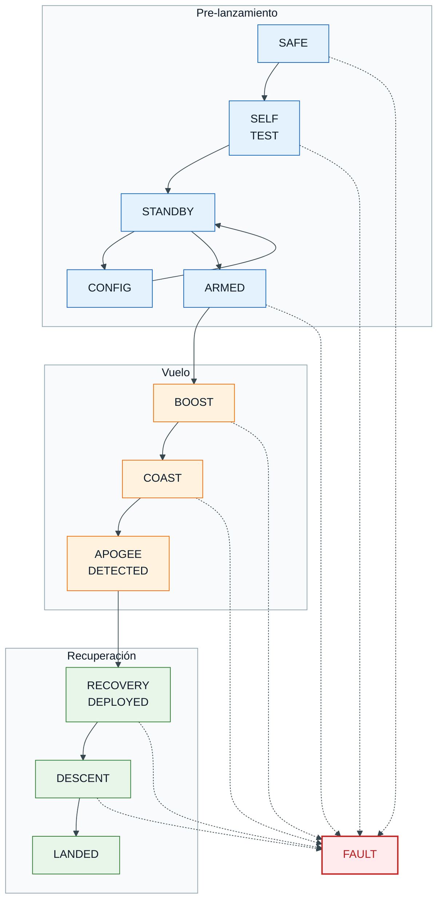
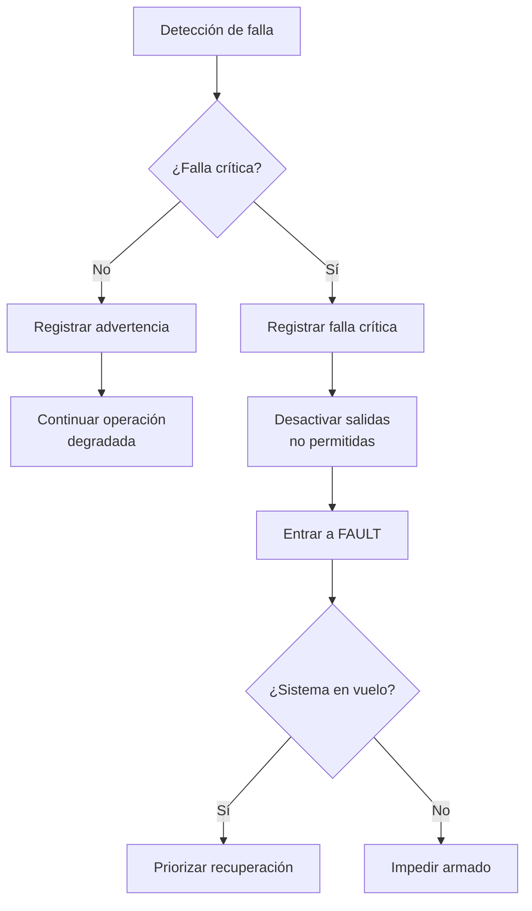

# Concepto de Operaciones

**Sistema:** Controladora de Vuelo V2

**Versión:** v0.1

**Fecha:** 09/06/2026

---

## 1. Propósito

Este documento define el **Concepto de Operaciones**, o **CONOPS**, de la Controladora de Vuelo para Cohete Experimental.


Su propósito es describir cómo se utilizará la controladora durante una misión completa, desde la preparación en tierra hasta la recuperación del vehículo y el análisis post-vuelo.

El CONOPS sirve como base para derivar:

* Requisitos de sistema.
* Requisitos de software.
* Arquitectura del firmware.
* Máquina de estados.
* Análisis de seguridad.
* Casos de prueba.
* Matriz de trazabilidad.

La controladora deberá ser capaz de ejecutar la misión de forma autónoma usando sensores embarcados, lógica interna de misión y registro local de datos.

!!! info "Estado de la telemetría: La telemetría se considera una función en desarrollo (**W.I.P.**) y no forma parte del alcance funcional mínimo de esta versión del sistema."

---

## 2. Descripción general del sistema

La Controladora de Vuelo es un sistema electrónico embarcado diseñado para operar en cohetes experimentales.

Su función principal es:

* Adquirir datos de sensores.
* Detectar eventos relevantes de la misión.
* Registrar información de vuelo.
* Ejecutar eventos de recuperación.
* Mantener el sistema en una condición segura ante fallas.
* Permitir análisis post-vuelo.

La controladora puede integrar sensores inerciales, sensores ambientales, almacenamiento externo, interfaces de comunicación y salidas de actuación.

!!! warning "Principio de seguridad: Las funciones críticas de seguridad, como recuperación y salidas pirotécnicas, deben operar de forma independiente de funciones no críticas como telemetría, USB o logging extendido."

---

## 3. Alcance operativo

El sistema cubre las operaciones desde la preparación previa al lanzamiento hasta la descarga y análisis de datos.

### Incluido:

* Encendido del sistema.
* Autodiagnóstico.
* Configuración de misión.
* Armado de la controladora.
* Detección de lanzamiento.
* Detección de MECO.
* Detección de apogeo.
* Activación de recuperación.
* Registro de datos.
* Manejo de fallas.
* Descarga de datos por interfaz local, si aplica.

### No incluido en esta versión:

* Sistemas de control de rate, actitud, trayectoria, etc.
* Sistema de transmisión de telemetría. Actualmente se considera una función **W.I.P.**
* Obtención de posición GNSS.
* Estimación de actitud.
* Control activo del vehículo.

---

## 4. Actores del sistema

| Actor                   | Descripción                                                                                                                                                     |
| ----------------------- | --------------------------------------------------------------------------------------------------------------------------------------------------------------- |
| Operador de tierra      | Persona encargada de configurar, armar, monitorear localmente y recuperar los datos del sistema.                                                                |
| Equipo de integración   | Responsable de instalar la controladora en el cohete y verificar conexiones.                                                                                    |
| Cohete                  | Vehículo portador de la controladora.                                                                                                                           |
| Sistema de recuperación | Paracaídas, mecanismos de despliegue o cargas controladas por la tarjeta.                                                                                       |
| Estación de tierra      | Radiocontrol o interfaz USB utilizada para configuración, descarga de datos y revisión post-vuelo. La telemetría en tiempo real se considera una función futura.|
| Firmware                | Software embebido encargado de ejecutar la lógica de misión.                                                                                                    |
| Hardware de seguridad   | Elementos físicos de protección, inhibición, potencia y aislamiento.                                                                                            |

---

## 5. Suposiciones iniciales

Para esta versión del CONOPS se asume lo siguiente:

* El cohete es experimental y de uso académico.
* La controladora se energiza antes del lanzamiento.
* El sistema cuenta con al menos una IMU y un sensor barométrico operativos.
* Existen salidas dedicadas para eventos de recuperación.
* Las salidas críticas permanecen desactivadas después de encendido o reset.
* El armado del sistema requiere una acción explícita.
* El firmware registra datos durante la misión.
* La seguridad tiene prioridad sobre toda función.

---

## 6. Estados operativos

La controladora se organiza mediante una máquina de estados. Cada estado limita qué acciones son válidas y qué transiciones están permitidas.

| Estado              | Descripción                                                                     |
| ------------------- | ------------------------------------------------------------------------------- |
| `SAFE`              | Estado inicial o de protección. Todas las salidas críticas permanecen apagadas. |
| `SELF_TEST`         | Verificación de sensores, memoria, alimentación, configuración y salidas.       |
| `STANDBY`           | Sistema listo, pero no armado.                                                  |
| `CONFIGURATION`     | Estado donde se permite modificar o revisar parámetros de misión.               |
| `ARMED`             | Sistema listo para vuelo. Monitorea la condición de lanzamiento.                |
| `BOOST`             | Lanzamiento detectado. El cohete se encuentra en ascenso propulsado.            |
| `COAST`             | Vuelo balístico posterior al fin de empuje o MECO.                              |
| `APOGEE_DETECTED`   | Se detectó la condición de apogeo.                                              |
| `RECOVERY_DEPLOYED` | Se ejecutó el evento de recuperación.                                           |
| `DESCENT`           | El cohete se encuentra descendiendo.                                            |
| `LANDED`            | El sistema detectó fin de vuelo.                                                |
| `FAULT`             | Estado de falla controlada.                                                     |


---

En el diagrama se pueden apreciar los diferentes estados de la controladora. Los estados de pre-lanzamiento agrupan los procedimientos de inicio seguro, autodiagnóstico, espera, configuración y armado. En esta fase no se podrán activar las cargas pirotécnicas, y los actuadores deberán mantenerse en su estado seguro.

Para armar el sistema será necesario enviar un comando válido de activación, ya sea por una interfaz de configuración o mediante SBUS en el canal configurado para armado, si esta función se encuentra habilitada.

Las etapas de vuelo comienzan con la detección del empuje generado por el motor y terminan con la detección del apogeo. Finalmente, se continúa con el despliegue del sistema de recuperación, el cual habilita la activación controlada de las salidas de recuperación y cambia la configuración de actuadores a su estado de despliegue, si aplica.

La descripción de cada estado, sus tareas principales y condiciones de transición se desarrolla en la sección 7, **Fases de operación**.



---

## 7. Fases de operación

Las fases de operación determinan el estado actual de la misión, las consideraciones que se deben de tener y las limitaciones operativas y de decisión que se tienen en cada etapa. Es importante definirlas para mantener la seguridad operativa en todo momento una vez inicializa la misión hasta que termina. Las fases de misión consideradas se encuentran detalladas en este capítulo.

### 7.1 Preparación en tierra

Durante esta fase, la controladora puede estar fuera del cohete o integrada parcialmente.

**Actividades principales:**

* Verificar versión de firmware.
* Cargar parámetros de misión.
* Verificar estado físico de la tarjeta.
* Revisar conexiones.
* Confirmar que las salidas críticas estén inhibidas.
* Preparar almacenamiento de datos.
* Validar comunicación local con la estación de tierra, si aplica.

!!! note "Resultado esperado: La controladora queda configurada y lista para integración o armado."

---

### 7.2 Encendido

Al recibir alimentación, el sistema debe entrar en una condición segura. El sistema inicializa en `SAFE` y **realiza las siguientes acciones**:

* Inicializar microcontrolador.
* Inicializar periféricos.
* Mantener salidas críticas apagadas.
* Inicializar sensores.
* Inicializar almacenamiento.
* Inicializar comunicaciones locales, si aplica.
* Cargar configuración.
* Validar integridad de parámetros.

Al completar la lista de tareas, pasa al estado de `SELF_TEST`

!!! danger "Regla crítica: Después de cualquier encendido o reset, ninguna salida pirotécnica deberá ser capaz de activarse automáticamente."

---

### 7.3 Autodiagnóstico

El sistema verifica que los módulos mínimos estén disponibles.


| Módulo             | Verificación esperada                       |
| ------------------ | ------------------------------------------- |
| IMU                | Comunicación y lectura válida.              |
| Barómetro          | Comunicación y presión inicial válida.      |
| Memoria            | Escritura o disponibilidad.                 |
| Configuración      | CRC, versión y parámetros válidos.          |
| Salidas críticas   | Estado apagado confirmado.                  |
| Watchdog           | Inicializado y activo.                      |
| Tiempo del sistema | Sistema operativo en tiempo real funcional. |


Resultados posibles:

| Resultado            | Acción                                        |
| -------------------- | --------------------------------------------- |
| Diagnóstico aprobado | Pasar a `STANDBY`.                            |
| Falla no crítica     | Permitir operación degradada con advertencia. |
| Falla crítica        | Pasar a `FAULT`.                              |

!!! info "Si la dirección de memoria asignada a el registro de `FAULT` se encuentra en `0xAA`, cambia el estado automáticamente a `FAULT`."

---

### 7.4 Configuración

El operador puede cargar o revisar parámetros de misión.

Ejemplos de parámetros:

* Frecuencia de logging.
* Umbral de detección de lanzamiento.
* Criterios de detección de apogeo.
* Temporizador de respaldo para recuperación.
* Duración de activación de salidas.
* Identificador de misión.
* Canales habilitados.
* Parámetros de comunicación local, si aplica.
* Parámetros de telemetría reservados para versiones futuras.

Para información detallada de las configuraciones actuales, consulta el apartado de [Configuraciones](configuraciones.md).

!!! warning "Restricción: No deberán ser modificables parámetros críticos cuando el sistema esté en `ARMED`, `BOOST`, `COAST`, `APOGEE_DETECTED`, `RECOVERY_DEPLOYED` o `DESCENT`."

---

### 7.5 Armado

El armado permite que la controladora pase de una condición segura a una condición lista para vuelo.

Condiciones mínimas para armar:

* Autodiagnóstico aprobado.
* Configuración válida.
* Sensores mínimos disponibles.
* Salidas críticas en estado apagado.
* Comando explícito de armado.

Estado resultante:

```text
ARMED
```

!!! danger "Condición de seguridad: El estado `ARMED` no debe activar salidas críticas. Únicamente habilita la lógica de detección de lanzamiento y posterior ejecución de misión."

---

### 7.6 Espera en plataforma

El cohete se encuentra instalado en la rampa. La controladora monitorea sensores buscando la condición de lanzamiento.

Acciones del sistema:

* Registrar datos.
* Monitorear aceleración.
* Monitorear presión y altitud relativa.
* Monitorear batería.
* Rechazar comandos no permitidos.
* Esperar detección de lanzamiento.
* Reservar el envío de estado por telemetría para versiones futuras.

Criterios posibles de lanzamiento:

| Criterio    | Descripción                                               |
| ----------- | --------------------------------------------------------- |
| Aceleración | Aceleración longitudinal mayor a un umbral.               |
| Altitud     | Cambio positivo de altitud durante una ventana de tiempo. |
| Combinado   | Aceleración y cambio de altitud coherentes.               |
| Externo     | Señal externa de lanzamiento, si existe.                  |

---

### 7.7 Ascenso propulsado

Durante el ascenso inicial, el cohete está bajo empuje del motor.

Estado:

```text
BOOST
```

Acciones del sistema:

* Registrar datos a frecuencia alta.
* Monitorear aceleraciones.
* Estimar altitud.
* Detectar fin de empuje o MECO, si aplica.
* Ignorar falsas condiciones de apogeo.
* Mantener bloqueadas acciones no permitidas.

Criterios posibles para pasar a `COAST`:

* Aceleración cae por debajo de un umbral.
* Tiempo desde lanzamiento supera la duración esperada de motor.
* La derivada de la velocidad vertical es negativa y menor a un umbral.

---

### 7.8 Vuelo balístico

Después del fin de empuje, el cohete continúa ascendiendo hasta apogeo.

Estado:

```text
COAST
```

Acciones del sistema:

* Estimar altitud.
* Estimar velocidad vertical.
* Filtrar datos de barómetro e IMU.
* Monitorear condiciones de apogeo.
* Registrar eventos.
* Preparar lógica de recuperación.

Criterios posibles para detectar apogeo:

| Criterio           | Descripción                                                                  |
| ------------------ | ---------------------------------------------------------------------------- |
| Velocidad vertical | La velocidad vertical estimada cambia de positiva a negativa.                |
| Máximo local       | La altitud barométrica alcanza un máximo local.                              |
| Tiempo mínimo      | La detección solo se habilita después de un tiempo mínimo desde lanzamiento. |
| Persistencia       | La condición debe mantenerse durante varias muestras.                        |
| Respaldo           | Se activa recuperación por temporizador si no se detecta apogeo.             |

---

### 7.9 Apogeo

El apogeo es el evento principal para iniciar recuperación.

Estado:

```text
APOGEE_DETECTED
```

Acciones esperadas:

* Registrar evento de apogeo.
* Solicitar activación de recuperación.
* Confirmar duración de pulso.
* Bloquear reactivaciones no deseadas.
* Pasar a `RECOVERY_DEPLOYED`.

!!! warning "Restricción: La activación de recuperación deberá ocurrir una sola vez por evento, salvo que se defina explícitamente una lógica redundante."

---

### 7.10 Recuperación

Una vez detectado el apogeo, el sistema ejecuta el evento de recuperación.

Estado:

```text
RECOVERY_DEPLOYED
```

Acciones esperadas:

* Activar la salida configurada.
* Mantener la salida activa durante el tiempo definido.
* Desactivar la salida al finalizar el pulso.
* Registrar inicio y fin de activación.
* Cambiar al estado `DESCENT`.

---

### 7.11 Descenso

Durante el descenso, la controladora continúa registrando datos.

Estado:

```text
DESCENT
```

Acciones esperadas:

* Registrar presión, altitud, aceleración y orientación.
* Monitorear posible apertura de paracaídas.
* Detectar aterrizaje.
* Reservar el monitoreo remoto por telemetría para versiones futuras.

Criterios posibles para detectar aterrizaje:

* Altitud estable durante una ventana de tiempo.
* Aceleración cercana a reposo.
* Velocidad vertical aproximada a cero.
* Tiempo máximo de vuelo alcanzado.

---

### 7.12 Aterrizaje

El sistema considera que el vuelo terminó.

Estado:

```text
LANDED
```

Acciones esperadas:

* Registrar evento de aterrizaje.
* Cerrar archivo de datos, si es posible.
* Desactivar salidas críticas.
* Esperar recuperación física del cohete.

### 7.12 Aterrizaje

Si en cualquiera de los estados se presentó un evento considerado como catastrofico que permite volver a una operación normal o degradada de la operación, se considera que el sistema entro en un estado de `FAULT`:

!!! danger "Acciones después de entrar al estado"
    Si entra antes de que se haya armado:
    
    * Todos los actuadores y cargas pirotecnicas pasan a valor de `SAFE`.

    * Desabilita la capacidad de armar el sistema.

    * Escribe en la memoria flash interna del microcontrolador, en la dirección de memoria asignada un valor de `0xAA`.

    * Bloquea todos los comandos USB excepto FAULT_REGISTER.


    Si entra después de que el sistema se encuentre armado (Haya pasado por el estado de `Armed`):
    
    * Inicia un temporizador para ejecutar la tarea de despliegue del sistema de recuperación con el tiempo de falla configurado, si el valor es invalido o no puede ser leído, el temporizador por default es de 5 segundos.

    * Una vez completada la secuencia, todos los actuadores y cargas pirotecnicas pasan a valor de `SAFE`.

    * Escribe en la memoria flash interna del microcontrolador, en la dirección de memoria asignada un valor de `0xAA`.

    * Bloquea todos los comandos USB excepto FAULT_REGISTER.


!!! warning "Bajo ningún concepto el sistema debe volver a operar una vez presentada la falla. La única forma de regresar el registro a su estado seguro es enviando un comando para sobreescribir la dirección de memoria con un valor de `0x00`, lo que inicializará el sistema en estado `SAFE`"


---

## 8. Condiciones anormales

| Condición                   | Respuesta esperada                                                          |
| --------------------------- | --------------------------------------------------------------------------- |
| Reset antes del lanzamiento | Reiniciar en `SAFE`; salidas apagadas.                                      |
| Reset durante vuelo         | Recuperar o inferir estado seguro; evitar activaciones accidentales.        |
| Falla de memoria flash      | Continuar misión; registrar eventos mínimos si existe memoria alternativa.  |
| Telemetría no disponible    | No afecta la misión nominal. La controladora debe operar de forma autónoma. |
| Falla de IMU                | Usar barómetro o temporizador de respaldo, si está definido.                |
| Falla de barómetro          | Usar IMU o temporizador de respaldo si en vuelo, no permite armado.         |
| Sensor incoherente          | Rechazar muestra, filtrar o pasar a modo degradado.                         |
| Comando inválido            | Rechazar comando y registrar evento.                                        |
| Watchdog timeout            | Reiniciar sistema en condición segura.                                      |

---

## 9. Estado de falla controlada

El estado `FAULT` representa una condición anormal detectada por el firmware.



!!! danger "Prioridad del estado FAULT"
    En una falla crítica, el sistema debe priorizar la seguridad de la misión sobre logging, comunicación o funciones auxiliares.

---

## 10. Reglas de seguridad

Estas reglas deben convertirse en requisitos verificables.

| ID preliminar   | Regla                                                                                                                                                                         |
| --------------- | ----------------------------------------------------------------------------------------------------------------------------------------------------------------------------- |
| `SAFE-RULE-001` | Las salidas críticas deberán permanecer apagadas después de encendido, reset o entrada a estado seguro.                                                                       |
| `SAFE-RULE-002` | El sistema no deberá permitir armado si existe una falla crítica.                                                                                                             |
| `SAFE-RULE-003` | La activación de recuperación deberá depender de condiciones verificables.                                                                                                    |
| `SAFE-RULE-004` | La detección de apogeo no deberá estar habilitada inmediatamente después del lanzamiento.                                                                                     |
| `SAFE-RULE-005` | La misión no deberá depender de telemetría para ejecutar detección de lanzamiento, detección de MECO, detección de apogeo, recuperación o registro local de eventos críticos. |
| `SAFE-RULE-006` | La falla del sistema de logging no deberá impedir la recuperación.                                                                                                            |
| `SAFE-RULE-007` | Todo evento crítico deberá registrarse con timestamp.                                                                                                                         |
| `SAFE-RULE-008` | Los comandos de configuración deberán bloquearse durante vuelo.                                                                                                               |
| `SAFE-RULE-009` | El firmware deberá tener una respuesta definida para fallas de sensores.                                                                                                          |
| `SAFE-RULE-010` | El sistema deberá distinguir entre estado seguro, armado y vuelo.                                                                                                             |

---

## 11. Eventos registrados

La controladora deberá registrar eventos relevantes para reconstruir la misión.

| Evento                      | Descripción                                 |
| --------------------------- | ------------------------------------------- |
| `SYSTEM_BOOT`               | El sistema inició.                          |
| `SELF_TEST_PASS`            | El autodiagnóstico fue aprobado.            |
| `SELF_TEST_FAIL`            | El autodiagnóstico falló.                   |
| `CONFIG_LOADED`             | La configuración fue cargada correctamente. |
| `CONFIG_ERROR`              | La configuración no es válida.              |
| `ARMED`                     | El sistema fue armado.                      |
| `DISARMED`                  | El sistema fue desarmado.                   |
| `LAUNCH_DETECTED`           | Se detectó lanzamiento.                     |
| `BOOST_END`                 | Se detectó fin de empuje o MECO.            |
| `APOGEE_DETECTED`           | Se detectó apogeo.                          |
| `RECOVERY_OUTPUT_ACTIVATED` | Se activó salida de recuperación.           |
| `RECOVERY_OUTPUT_FINISHED`  | Finalizó la activación de recuperación.     |
| `LANDING_DETECTED`          | Se detectó aterrizaje.                      |
| `FAULT_DETECTED`            | Se detectó una falla.                       |
| `SYSTEM_RESET`              | El sistema se reinició.                     |

---

## 12. Información generada durante la misión

La controladora deberá producir, como mínimo:

* Archivo de log de vuelo.
* Eventos críticos con timestamp.
* Estado de misión.
* Lecturas de sensores.
* Estado de batería.
* Estado de salidas.
* Código de fallas.
* Versión de firmware.
* Configuración usada en el vuelo.

---

## 13. Criterios de éxito de misión

La misión de la controladora se considera exitosa si:

* El sistema inicia correctamente.
* Las salidas críticas permanecen seguras antes del armado.
* El sistema permite armado únicamente bajo condiciones válidas.
* Se detecta lanzamiento.
* Se registra información de vuelo.
* Se detecta MECO o se cumple una condición equivalente de transición.
* Se detecta apogeo o se ejecuta una condición de respaldo.
* Se activa recuperación dentro de la ventana definida.
* El sistema conserva datos suficientes para análisis post-vuelo.
* No existen activaciones no comandadas.
* Las fallas se registran y no comprometen funciones críticas.
* La misión se ejecuta sin depender de telemetría.

---

## 14. Relación con requerimientos

A partir de este CONOPS se derivarán los siguientes grupos de requerimientos:

| Grupo       | Descripción                                                              |
| ----------- | ------------------------------------------------------------------------ |
| `SYS-OPR`   | requerimientos operacionales.                                            |
| `SYS-SAFE`  | requerimientos de seguridad.                                             |
| `SYS-FSM`   | requerimientos de máquina de estados.                                    |
| `SYS-SENS`  | requerimientos de sensores.                                              |
| `SYS-REC`   | requerimientos de recuperación.                                          |
| `SYS-LOG`   | requerimientos de logging.                                               |
| `SYS-COM`   | requerimientos de comunicación local y futuras interfaces de telemetría. |
| `SYS-PWR`   | requerimientos de alimentación.                                          |
| `SYS-FAULT` | requerimientos de manejo de fallas.                                      |
| `SYS-TEST`  | requerimientos de verificación.                                          |

---

## 15. Requisitos preliminares derivados

| ID              | Requisito                                                                                                                                                      | Fuente                            | Verificación                                           |
| --------------- | -------------------------------------------------------------------------------------------------------------------------------------------------------------- | --------------------------------- | ------------------------------------------------------ |
| `SYS-FSM-001`   | La controladora deberá implementar una máquina de estados de misión que controle las transiciones entre operación en tierra, vuelo, recuperación y post-vuelo. | CONOPS, Sección 6                 | Revisión de diseño y prueba de integración.            |
| `SYS-SAFE-001`  | La controladora deberá mantener todas las salidas críticas desactivadas después de encendido, reset o entrada a estado seguro.                                 | CONOPS, Secciones 7.2 y 10        | Prueba HIL, revisión de código y prueba de reset.      |
| `SYS-SAFE-002`  | La controladora deberá impedir el armado cuando exista una falla crítica activa.                                                                               | CONOPS, Secciones 7.3 y 10        | Prueba funcional.                                      |
| `SYS-REC-001`   | La controladora deberá activar el sistema de recuperación cuando se detecte apogeo o cuando se cumpla una condición de respaldo configurada.                   | CONOPS, Secciones 7.8, 7.9 y 7.10 | Simulación, prueba HIL y prueba de integración.        |
| `SYS-LOG-001`   | La controladora deberá registrar eventos críticos con timestamp.                                                                                               | CONOPS, Sección 11                | Revisión de log y prueba funcional.                    |
| `SYS-COM-001`   | La controladora deberá ejecutar la misión nominal sin depender de telemetría en tiempo real.                                                                   | CONOPS, Secciones 3, 5 y 10       | Prueba funcional sin módulo de comunicación conectado. |
| `SYS-FAULT-001` | El sistema deberá entrar en un estado de falla controlada cuando se detecte una falla crítica.                                                                 | CONOPS, Sección 9                 | Inyección de fallas.                                   |
| `SYS-PWR-001`   | La controladora deberá impedir el armado si el voltaje de batería se encuentra por debajo del umbral configurado.                                              | CONOPS, Sección 7.3               | Prueba con fuente variable.                            |

---

## 17. Próximos documentos

A partir de este CONOPS se recomienda desarrollar:

* Lista de funciones del sistema.
* Requisitos de sistema.
* Requisitos de software de alto nivel.
* Arquitectura de software.
* Arquitectura de hardware-software.
* Plan de verificación.
* Matriz de trazabilidad.
* Análisis preliminar de peligros.
* FMEA inicial.
* Plan de pruebas HIL.
* Reporte de pruebas de vuelo.

---

## 18. Historial de cambios

| Versión | Fecha      | Descripción                                  | Autor               |
| ------- | ---------- | -------------------------------------------- | ------------------- |
| v0.1    | 09/06/2026 | Versión inicial del Concepto de Operaciones. | Christian de Alba   |