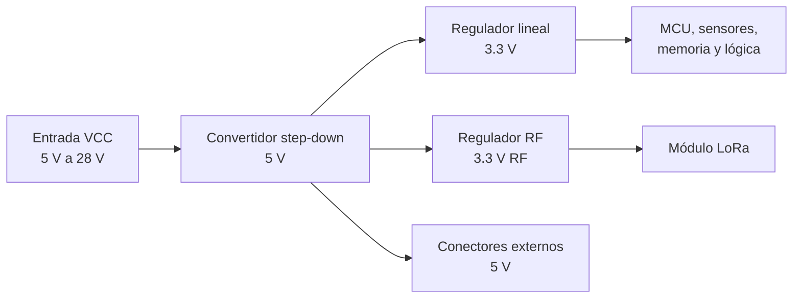

# Alimentación

Esta sección describe la arquitectura de alimentación de la **Controladora de Vuelo V2**, los rieles internos de voltaje, las recomendaciones de conexión y las precauciones necesarias antes de energizar la tarjeta.

La alimentación es uno de los subsistemas más importantes de la tarjeta, ya que de ella dependen el microcontrolador, sensores, memoria externa, comunicación, salidas PWM, telemetría y canales de eventos de misión.

!!! warning "Revisión previa"
    Antes de alimentar la tarjeta, revisa polaridad, continuidad, voltaje de entrada, conexiones de tierra y ausencia de cortocircuitos. No conectes cargas críticas durante las primeras pruebas de encendido.

## Resumen general

La Controladora de Vuelo V2 está diseñada para recibir alimentación principal desde una batería o fuente externa conectada al riel `VCC`. A partir de esta entrada, la tarjeta genera los rieles internos necesarios para alimentar sus diferentes subsistemas.

| Riel     | Voltaje nominal | Uso principal                                                           |
| -------- | --------------: | ----------------------------------------------------------------------- |
| `VCC`    |      5 V a 28 V | Entrada principal de alimentación.                                      |
| `5V`     |             5 V | Alimentación intermedia, conectores externos y reguladores secundarios. |
| `3V3`    |           3.3 V | Microcontrolador, sensores, memoria y lógica digital.                   |
| `3V3_RF` |           3.3 V | Alimentación dedicada para el módulo de radiofrecuencia LoRa.           |

El diagrama visual de conexiones indica compatibilidad con alimentación desde **2S hasta 6S**, equivalente aproximadamente a un rango de **5 V a 28 V**.

!!! note "Rango de alimentación"
    Aunque el rango nominal indicado es de 5 V a 28 V, se recomienda validar la fuente utilizada, el consumo total y la temperatura de los reguladores antes de operar la tarjeta en condiciones reales.

## Arquitectura de alimentación

El sistema de alimentación puede dividirse en tres etapas principales:

1. Entrada principal `VCC`.
2. Regulación step-down de `VCC` a `5V`.
3. Regulación lineal de `5V` a `3V3`.
4. Regulación dedicada de `5V` a `3V3_RF`.

## Entrada principal `VCC`

La entrada `VCC` corresponde al suministro principal de la tarjeta. Esta entrada alimenta el regulador step-down encargado de generar el riel de `5V`.

| Parámetro       | Descripción                          |
| --------------- | ------------------------------------ |
| Señal           | `VCC`                                |
| Rango indicado  | 5 V a 28 V                           |
| Fuente típica   | Batería o fuente externa regulada    |
| Uso             | Alimentación principal de la tarjeta |
| Tierra asociada | `GND`                                |

El conector de entrada principal debe conectarse respetando la polaridad indicada en el diagrama de conexiones.

!!! danger "Polaridad incorrecta"
    Una inversión de polaridad o una conexión incorrecta en `VCC` y `GND` puede dañar permanentemente la tarjeta y los periféricos conectados.

## Regulador step-down de 5 V

La primera etapa de regulación convierte la tensión de entrada `VCC` a un riel intermedio de **5 V**. Este riel alimenta conectores externos y sirve como entrada para los reguladores secundarios.

En el esquemático, esta etapa utiliza un convertidor step-down basado en el componente **MP2386GTL-Z**, acompañado de un inductor, capacitores de entrada/salida y red de realimentación.

| Elemento      | Descripción                |
| ------------- | -------------------------- |
| Regulador     | MP2386GTL-Z                |
| Tipo          | Convertidor step-down      |
| Entrada       | `VCC`                      |
| Salida        | `5V`                       |
| Inductor      | 6.8 µH                     |
| Uso principal | Generación del riel de 5 V |

El riel `5V` se utiliza para:

* Alimentación de conectores externos.
* Alimentación del regulador de 3.3 V.
* Alimentación del regulador dedicado para radiofrecuencia.
* Alimentación de periféricos compatibles, según el conector utilizado.

!!! warning "Corriente disponible"
    La corriente máxima disponible en el riel de `5V` debe validarse mediante pruebas y revisión del diseño térmico. No se recomienda asumir que este riel puede alimentar cargas de alta corriente sin una verificación previa.

## Regulador lineal de 3.3 V

A partir del riel de `5V`, la tarjeta genera el riel lógico de **3.3 V** mediante un regulador lineal.

| Riel    | Descripción                     |
| ------- | ------------------------------- |
| Entrada | `5V`                            |
| Salida  | `3V3`                           |
| Uso     | Alimentación lógica del sistema |

El riel `3V3` alimenta principalmente:

* Microcontrolador STM32F722RET6.
* Memoria flash externa.
* Sensores inerciales.
* Sensor ambiental.
* Señales lógicas de periféricos.
* Circuitos auxiliares de baja potencia.

!!! note "Riel lógico"
    El riel `3V3` está destinado principalmente a la lógica digital y sensores internos. No debe utilizarse para alimentar cargas externas de alta corriente.

## Regulador dedicado `3V3_RF`

El sistema incluye un riel de alimentación separado para el módulo de radiofrecuencia, identificado como `3V3_RF`.

| Riel    | Descripción                            |
| ------- | -------------------------------------- |
| Entrada | `5V`                                   |
| Salida  | `3V3_RF`                               |
| Uso     | Alimentación del módulo LoRa RA-01SH-P |

Separar la alimentación del módulo RF ayuda a aislar parcialmente el consumo del radio del resto de la lógica digital.

!!! note "Módulo RF"
    El consumo del módulo LoRa puede variar durante transmisión. Se recomienda validar el comportamiento del riel `3V3_RF` durante pruebas de telemetría.

## Conectores alimentados por 5 V

El riel de `5V` está disponible en distintos conectores externos de la tarjeta.

| Conector                  | Señal de alimentación | Uso previsto                                                                       |
| ------------------------- | --------------------- | ---------------------------------------------------------------------------------- |
| Conector de servos / SBUS | `5V`                  | Receptor SBUS, servos o periféricos compatibles.                                   |
| Conector CAN              | `+5V`                 | Alimentación auxiliar para periféricos CAN.                                        |
| Conector GPS              | `5V`                  | Alimentación de módulo GPS externo.                                                |
| USB                       | `VBUS` / `5V`         | Detección o alimentación asociada al puerto USB, según configuración del hardware. |

!!! warning "Cargas externas"
    Antes de alimentar periféricos desde la tarjeta, calcula o mide el consumo total. Servos, módulos externos y radios pueden generar picos de corriente que provoquen caídas de voltaje o reinicios del sistema.

## Tierra del sistema

Todas las señales de alimentación y comunicación deben compartir una referencia común de tierra `GND`.

| Señal    | Descripción                        |
| -------- | ---------------------------------- |
| `GND`    | Tierra común de la tarjeta         |
| `VCC`    | Entrada principal referida a `GND` |
| `5V`     | Riel de 5 V referido a `GND`       |
| `3V3`    | Riel lógico referido a `GND`       |
| `3V3_RF` | Riel RF referido a `GND`           |

Una conexión incorrecta de tierra puede causar fallas de comunicación, lecturas inestables en sensores, reinicios o comportamiento errático en periféricos.

## Alimentación por USB

La tarjeta cuenta con conector Micro USB. Este puerto puede utilizarse para comunicación local, configuración o depuración, dependiendo del firmware cargado.

!!! danger "USB y alimentación principal"
    No es posible conectar ´VCC´ y ´+5V´ de USB al mismo tiempo, para obtener información y enviar comandos mientras se alimenta con una batería, es necesario modificar el cable y asegurarse que la linea de ´+5V´ esté desconectada.

Durante pruebas de escritorio, se recomienda confirmar:

* Si el USB alimenta completamente la tarjeta o solo proporciona comunicación.
* Si el riel `5V` externo puede aparecer en el conector USB.
* Si existe aislamiento, diodo, protección o selección automática entre fuentes.
* Si la computadora queda protegida ante una alimentación externa conectada.

## Canales de eventos de misión

La tarjeta incluye dos canales independientes para eventos de misión. Estos canales se encuentran asociados al conector principal y a sus interruptores físicos de armado.

| Canal   | Descripción                                  |
| ------- | -------------------------------------------- |
| `PYRO1` | Canal independiente para evento de misión 1. |
| `PYRO2` | Canal independiente para evento de misión 2. |

!!! danger "Salidas críticas"
    No conectes cargas críticas, sistemas de recuperación, ignitores o mecanismos peligrosos durante pruebas de alimentación, programación o depuración. Las primeras pruebas deben realizarse con los canales críticos desconectados y desarmados físicamente.

!!! warning "Interruptores físicos"
    Los interruptores físicos de armado deben mantenerse en posición segura durante cualquier prueba de alimentación inicial. El armado físico no sustituye la validación del firmware ni los procedimientos de seguridad del equipo.

## Procedimiento recomendado de primer encendido

Antes de alimentar una tarjeta por primera vez, se recomienda seguir este procedimiento:

1. Inspeccionar visualmente la PCB.
2. Verificar orientación de componentes críticos.
3. Revisar soldaduras, puentes o residuos.
4. Medir continuidad entre `VCC` y `GND`.
5. Medir continuidad entre `5V` y `GND`.
6. Medir continuidad entre `3V3` y `GND`.
7. Alimentar con una fuente limitada en corriente.
8. Comenzar con un voltaje bajo dentro del rango permitido.
9. Verificar el riel `5V`.
10. Verificar el riel `3V3`.
11. Verificar el riel `3V3_RF`.
12. Confirmar que el microcontrolador no se caliente.
13. Confirmar que los sensores y periféricos no se calienten.
14. Verificar que las salidas críticas permanezcan deshabilitadas.

!!! tip "Fuente de laboratorio"
    Para el primer encendido, es recomendable usar una fuente de laboratorio con límite de corriente. Esto permite detectar cortocircuitos o consumo excesivo antes de dañar componentes.

## Puntos de verificación

Durante la revisión eléctrica, se recomienda medir los siguientes puntos:

| Punto    |              Valor esperado |
| -------- | --------------------------: |
| `VCC`    | Voltaje de entrada aplicado |
| `5V`     |         Aproximadamente 5 V |
| `3V3`    |       Aproximadamente 3.3 V |
| `3V3_RF` |       Aproximadamente 3.3 V |
| `GND`    |            Referencia común |

!!! note "Tolerancias"
    Los valores medidos pueden variar ligeramente dependiendo del regulador, carga conectada, precisión del multímetro y condiciones de operación. Si el valor se aleja significativamente del esperado, detén la prueba y revisa el circuito.

## Recomendaciones de integración

Al integrar la tarjeta en un cohete, banco de pruebas o sistema externo, considera lo siguiente:

* Usar conectores firmes y adecuados para vibración.
* Evitar cables sueltos o sin alivio mecánico.
* Mantener cables de potencia alejados de señales sensibles.
* Separar físicamente líneas de eventos críticos de líneas de comunicación.
* Verificar que todos los periféricos compartan tierra común.
* Evitar alimentar servos de alta corriente desde la tarjeta sin validación.
* Documentar el tipo de batería, voltaje nominal y corriente estimada.
* Realizar pruebas de vibración o movimiento antes de pruebas reales.
* Validar el consumo total con todos los periféricos conectados.

## Problemas comunes

| Problema                                     | Posible causa                                           | Revisión recomendada                                                 |
| -------------------------------------------- | ------------------------------------------------------- | -------------------------------------------------------------------- |
| La tarjeta no enciende                       | Polaridad incorrecta, fuente apagada o conexión abierta | Revisar `VCC`, `GND`, conector y fuente.                             |
| El riel `5V` no aparece                      | Falla en regulador step-down o habilitación             | Revisar entrada `VCC`, red de habilitación y salida del regulador.   |
| El riel `3V3` no aparece                     | Falla en regulador lineal o corto en lógica             | Revisar entrada de 5 V y consumo en 3.3 V.                           |
| La tarjeta se reinicia al mover servos       | Caída de voltaje por consumo elevado                    | Usar fuente externa para servos o validar capacidad del riel de 5 V. |
| El módulo LoRa falla al transmitir           | Caída de voltaje en `3V3_RF`                            | Medir riel RF durante transmisión.                                   |
| El microcontrolador se calienta              | Corto, sobrevoltaje o componente dañado                 | Desconectar alimentación y revisar continuidad.                      |
| La computadora se desconecta al conectar USB | Conflicto de alimentación o corto en USB                | Revisar puerto USB, protección ESD y relación con riel de 5 V.       |

## Limitaciones y pendientes

Las siguientes características deben validarse o documentarse con mayor detalle conforme avance el proyecto:

* Corriente máxima disponible en el riel de `5V`.
* Corriente máxima recomendada para periféricos externos.
* Corriente máxima segura en conectores.
* Comportamiento térmico de los reguladores.
* Compatibilidad entre alimentación por USB y alimentación externa.
* Consumo total durante operación con LoRa, sensores y salidas PWM.
* Pruebas de caída de voltaje durante eventos de alta carga.

## Páginas relacionadas

* [Introducción al hardware](Hardware.md)
* [Especificaciones técnicas](especificaciones.md)
* [Conectores y pinout](conectores-pinout.md)
* [Archivos de fabricación](archivos-fabricacion.md)
* [Consideraciones de diseño](consideraciones-diseno.md)
